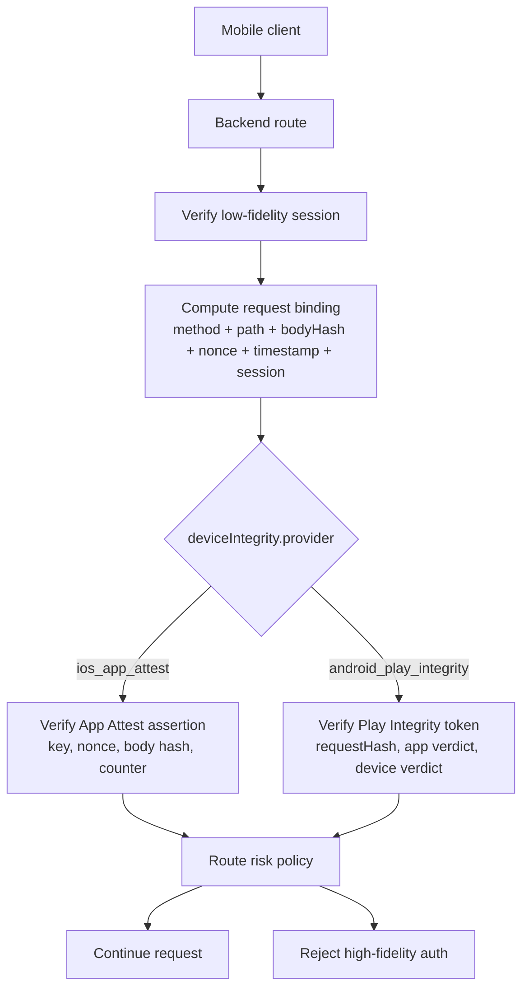
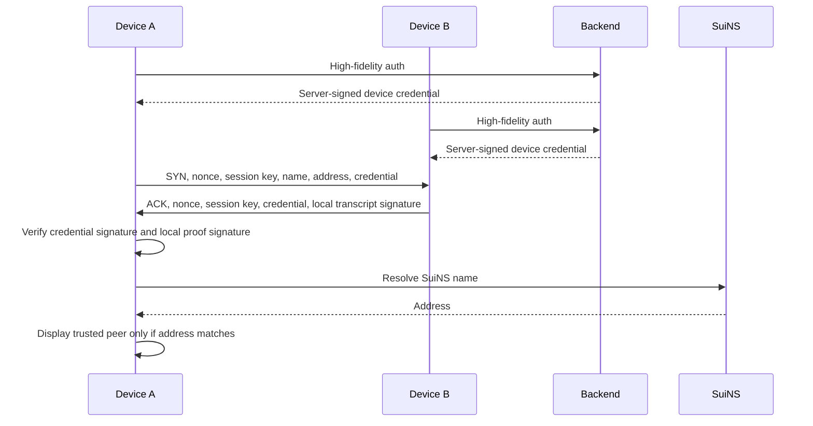

# 002 - Auth Architecture

## Goal

Define the authentication and trust model for nearby payments.

This document covers:

- backend-required auth
- client-side-only local auth
- strict request validation for auth-sensitive routes
- high-fidelity versus low-fidelity backend auth
- blind auth for Nearby Assist
- zkLogin and OAuth session bootstrap
- platform device integrity trust
- SuiNS auth touchpoints only

This document does not define SuiNS custody, leaf-name lifecycle, profile metadata, or name-governance rules. Those belong in `004-arch-custodial-profiles`.

## Grounding

The design is based on the following current platform facts:

- OAuth for native apps should use an external user agent and PKCE. Native apps must not rely on embedded client secrets. See [RFC 8252](https://www.rfc-editor.org/rfc/rfc8252.html) and [RFC 7636](https://www.rfc-editor.org/rfc/rfc7636.html).
- Apple App Attest is a server-verified app/device integrity system. The server issues challenges, verifies attestations, stores the App Attest public key and counter, then verifies future assertions. See [Apple App Attest server validation](https://developer.apple.com/documentation/devicecheck/validating-apps-that-connect-to-your-server).
- Platform integrity APIs are not universally available, so the product must define unsupported-device behavior. Nearby payments should require platform-integrity-capable devices for high-fidelity auth.
- Android's closest equivalent is Google Play Integrity API. It checks that app actions or server requests come from the genuine app, installed by Google Play, running on a genuine/certified Android device. Standard requests support frequent on-demand checks and bind the verdict to a `requestHash`; classic requests use a `nonce`. See [Play Integrity overview](https://developer.android.com/google/play/integrity/overview), [Play Integrity verdicts](https://developer.android.com/google/play/integrity/verdicts), and [classic request nonce guidance](https://developer.android.com/google/play/integrity/classic).
- Play Integrity is not the same shape as App Attest. App Attest gives the backend a certified app/device key and later assertions over requests. Play Integrity gives the backend a Google-issued integrity token/verdict bound to request data. Treat both as platform-specific variants of one backend device integrity proof.
- Sui zkLogin uses OAuth identity material, an ephemeral keypair, a nonce, a stable salt, and a ZK proof to authorize Sui transactions without a traditional private key UX. See [Sui zkLogin integration](https://docs.sui.io/sui-stack/zklogin-integration).
- SuiNS names resolve to target addresses. SuiNS NFT ownership is the capability to mutate records, not itself a resolution method. Leaf subname custody and governance are deferred to `004-arch-custodial-profiles`. See [SuiNS Developer Guide](https://docs.suins.io/developer).
- Enoki Identity Subnames confirms a production-style custody pattern where a SuiNS domain can be transferred to an Enoki-managed contract that borrows the domain to create or delete subnames, then returns it to custody. See [Enoki Identity Subnames](https://docs.enoki.mystenlabs.com/subnames).

## Core Principle

Do not collapse identity, device trust, API session, and wallet authority into one concept.

```text
OAuth / OIDC      -> who the user is
Backend session   -> whether an API request belongs to an active login
Device integrity  -> whether the request came from a trusted app/device instance
zkLogin           -> whether the user can authorize Sui transactions
Local handshake   -> whether a nearby peer freshly proved possession of a trusted device key
SuiNS resolution  -> whether a displayed name resolves to the advertised Sui address
Sui finality      -> whether money actually moved
```

The backend should never treat "logged in" as equivalent to "authorized to move money".

## Auth Modes

The backend supports three auth modes.

```ts
export type BackendAuthFidelity = 'low' | 'high' | 'blind';
```

The client-to-client local protocol has a separate local verification mode.

```ts
export type LocalAuthFidelity = 'local-peer';
```

### Low Fidelity

Low fidelity means:

```text
valid backend access token
+ active session
+ active user
+ active device record
```

Low fidelity is acceptable for non-mutating or low-risk routes:

```text
GET /v1/me
GET /v1/profile
GET /v1/funding/deposits
GET /v1/payment-intents/{intentId}
GET /v1/payments/{paymentId}
```

Low fidelity must not authorize:

- payment submission
- new nearby receive sessions
- device credential minting
- deposit-route creation
- Nearby Assist relay
- wallet or SuiNS binding changes

### High Fidelity

High fidelity means:

```text
low fidelity session
+ platform device integrity proof
+ request nonce
+ timestamp window
+ request body hash
+ method/path binding
+ provider-specific replay protection
```

High fidelity is required for money-path and trust-path mutations:

```text
POST /v1/auth/session/refresh
POST /v1/devices/integrity/assert
POST /v1/devices/nearby-credential
POST /v1/nearby/sessions
POST /v1/nearby/sessions/{sessionId}/verify
POST /v1/payment-intents
POST /v1/payment-intents/{intentId}/submit
POST /v1/payment-intents/{intentId}/cancel
POST /v1/assist/relay
POST /v1/funding/deposit-routes
```

## Platform Device Integrity

The backend should expose one auth concept with platform-specific proof shapes.

```ts
export const iosAppAttestProofSchema = z
    .object({
        provider: z.literal('ios_app_attest'),
        keyId: z.string().min(1),
        assertion: z.string().min(1),
        nonce: z.string().min(1),
        timestampMs: z.number().int().positive(),
    })
    .strict();

export const androidPlayIntegrityProofSchema = z
    .object({
        provider: z.literal('android_play_integrity'),
        integrityToken: z.string().min(1),
        requestHash: z.string().regex(/^0x[a-fA-F0-9]{64}$/),
        timestampMs: z.number().int().positive(),
    })
    .strict();

export const deviceIntegrityProofSchema = z.discriminatedUnion('provider', [
    iosAppAttestProofSchema,
    androidPlayIntegrityProofSchema,
]);

export type DeviceIntegrityProvider = z.infer<typeof deviceIntegrityProofSchema>['provider'];
```

iOS verification:

```text
verify App Attest key belongs to this app/device
verify assertion over method/path/body hash/nonce/timestamp
verify and update App Attest counter
```

Android verification:

```text
decode/verify Play Integrity token through Google Play server or configured verifier
verify requestDetails.requestHash matches server-computed request hash
verify appIntegrity.appRecognitionVerdict is PLAY_RECOGNIZED
verify deviceIntegrity has required label for the action
verify timestamp freshness
apply tiered policy for MEETS_STRONG_INTEGRITY / MEETS_DEVICE_INTEGRITY / MEETS_BASIC_INTEGRITY
```

Suggested Android policy:

```text
money-path high fidelity:
  require PLAY_RECOGNIZED
  require MEETS_DEVICE_INTEGRITY or MEETS_STRONG_INTEGRITY

highest-risk actions:
  prefer MEETS_STRONG_INTEGRITY where available
  allow fallback only through explicit risk policy
```

Do not require Play Integrity to look like App Attest. The backend auth middleware should accept `deviceIntegrityProofSchema`, then dispatch to the platform verifier.



### Blind Fidelity

Blind fidelity is used for Nearby Assist.

The routing device forwards an opaque encrypted envelope. The backend authenticates the inner sender after decrypting the payload. The routing device must not be able to read, modify, or spoof the sender payload.

```text
device A encrypts payload to server public key
device A binds ciphertext hash / envelope metadata to its platform device integrity proof
device B forwards the envelope without reading it
server decrypts
server verifies device A's inner session and platform device integrity proof
server treats device B only as a transport
```

Blind fidelity must not trust the routing device for payment authority.

## Backend-Required Auth

Backend-required auth is needed whenever a trust credential, server-side session, or backend policy decision is created or changed.

Required backend paths:

```text
OAuth begin / complete
device integrity registration/assertion
backend session issuance
session refresh / revoke
zkLogin salt lookup or creation
wallet binding
device credential issuance
deposit-route creation
payment intent creation
payment transaction submission through backend
Nearby Assist relay
profile or SuiNS binding changes
```

The backend is the authority for:

- active session state
- device status
- device integrity state, including App Attest public key/counter state on iOS and Play Integrity verdict records on Android
- zkLogin salt storage
- wallet binding record
- device credential issuance
- risk and route-level policy

The backend is not the authority for:

- local peer proximity
- final Sui settlement
- SuiNS resolution result
- user transaction signature validity

## Strict Request Validation

Every backend-required auth route must pass strict Zod validation before auth-sensitive service logic runs.

The client is responsible for sending the exact request payload structure. The backend must reject malformed payloads instead of repairing them.

Rules:

- request body schemas are `.strict()`
- path params are validated
- query params are validated
- no unknown request body keys
- no implicit `null`
- no implicit `undefined`
- no empty string as a substitute for missing data
- no server-side normalization of auth-critical fields
- no coercion for business-critical values such as addresses, nonces, timestamps, signatures, key IDs, device IDs, or SuiNS names

Optional fields are allowed only when the domain truly supports omission. If a value is required for auth, replay protection, route policy, wallet binding, or local peer verification, it must be required in the schema.

Bad request payloads should fail at the schema boundary with a typed validation error.

```ts
export const highFidelityRequestSchema = z
    .object({
        deviceIntegrity: deviceIntegrityProofSchema,
        timestampMs: z.number().int().positive(),
    })
    .strict();
```

Do not write schemas like this for auth-sensitive routes:

```ts
export const weakDeviceIntegrityRequestSchema = z.object({
    provider: z.string().optional(),
    proof: z.string().nullable(),
    nonce: z.string().nullish(),
});
```

The route should validate before calling auth services:

```ts
routes.post(
    '/devices/integrity/assert',
    validateJson(highFidelityRequestSchema),
    auth('high'),
    async (c) => {
        const input = c.req.valid('json');
        const result = await createDeviceService(c.env).assertDeviceIntegrity(input);
        return c.json(result);
    },
);
```

## Client-Side-Only Local Auth

Client-side-only auth is used during the local nearby exchange.

The backend must not be in the hot path for the SYN/ACK local exchange.

The backend may have previously issued short-lived credentials, but the local exchange itself must be verifiable between the two devices:

```text
BLE discovery
local transport session establishment
peer nonce exchange
peer local proof signature over transcript
server-signed device credential verification
SuiNS name-to-address resolution
profile/avatar display decision
```



### Device Identity Credential

The backend issues a portable device credential only after high-fidelity auth.

The credential lets another client verify a nearby peer without calling the backend during the local exchange.
The credential is required because platform device integrity trust is bootstrapped by the server. A peer should verify the server-signed credential and a fresh local transcript signature from the credential's local proof key, not an untrusted key advertised directly over BLE.

```ts
export type DeviceIdentityCredential = {
    version: 1;
    userId: string;
    deviceId: string;
    platform: 'ios' | 'android';
    appBundleId: string;
    integrityProvider: 'ios_app_attest' | 'android_play_integrity';
    localProofPublicKey: string;
    suiAddress: string;
    suinsName: string;
    capabilities: {
        nearbyPayments: true;
        nearbyAssist: boolean;
    };
    issuedAt: number;
    expiresAt: number;
    issuer: 'nearby-payments-api';
    signature: string;
};
```

Credential TTL should be short enough to limit stale device trust, but long enough that nearby payments work during weak connectivity.

Suggested first version:

```ts
export const DEVICE_CREDENTIAL_TTL_SECONDS = 60 * 60 * 24;
```

### Local SYN/ACK Transcript

The local handshake must bind both peers, both nonces, both session keys, the displayed SuiNS name, and the advertised Sui address.

```ts
export type NearbySyn = {
    protocol: 'nearby-payments/1';
    role: 'payer' | 'recipient';
    sessionPublicKey: string;
    nonce: string;
    suinsName: string;
    suiAddress: string;
    credential: DeviceIdentityCredential;
    expiresAt: number;
};

export type NearbyAck = {
    protocol: 'nearby-payments/1';
    synHash: string;
    nonce: string;
    sessionPublicKey: string;
    suinsName: string;
    suiAddress: string;
    localTranscriptSignature: string;
};
```

The local transcript signature should cover the transcript hash.

```text
hash(
  protocol
  || syn_nonce
  || ack_nonce
  || payer_session_public_key
  || recipient_session_public_key
  || suins_name
  || sui_address
  || device_credential_hash
)
```

### Local Peer Verification

A peer may display the other party on the radar only after all local checks pass:

```text
1. device credential signature verifies against the server public key
2. credential is unexpired
3. credential capability allows nearby payments
4. credential SuiNS name matches the broadcast SuiNS name
5. credential Sui address matches the broadcast Sui address
6. SuiNS resolves the broadcast name to the broadcast address
7. local transcript signature verifies against the credential local proof public key
8. local transcript signature message equals the local transcript hash
```

If any check fails, the app must not display trusted profile metadata or allow payment initiation.

Local verification does not update backend device-integrity provider state. Freshness comes from:

- transcript-bound nonces
- short credential TTL
- SuiNS resolution check
- backend provider verification on the next high-fidelity backend request

## New Session Flow

New sessions require OAuth / zkLogin and platform device integrity.

```text
1. client creates zkLogin ephemeral keypair
2. client asks backend for OAuth begin parameters
3. backend creates state, PKCE challenge metadata, zkLogin nonce binding, and expiry
4. client completes OAuth using external user agent
5. backend verifies OAuth callback / ID token / nonce / issuer / audience
6. backend creates or loads stable zkLogin salt
7. client completes platform device integrity proof
8. backend verifies device integrity proof and stores provider-specific state
9. backend creates user, device, session, and wallet binding records
10. backend returns opaque session tokens and wallet bootstrap data
```

New session issuance fails if:

- OAuth provider is unsupported
- OAuth nonce or state is invalid
- zkLogin salt cannot be resolved
- platform device integrity is unavailable on a required platform/device
- platform device integrity proof fails
- device OS version is below the required minimum
- wallet address cannot be derived or verified

## Existing Session Flow

Existing sessions use opaque access and refresh tokens.

```ts
export type SessionRecord = {
    id: string;
    userId: string;
    deviceId: string;
    deviceIntegrityProvider: 'ios_app_attest' | 'android_play_integrity';
    accessTokenHash: string;
    refreshTokenHash: string;
    issuedAt: number;
    expiresAt: number;
    refreshExpiresAt: number;
    status: 'active' | 'revoked' | 'expired';
};
```

Use opaque tokens instead of client-visible JWT sessions.

Reasons:

- revocation is simple
- device binding is explicit
- risk policy can be checked server-side
- fewer client-visible claims are trusted

Suggested lifetimes:

```ts
export const ACCESS_TOKEN_TTL_SECONDS = 15 * 60;
export const REFRESH_TOKEN_TTL_SECONDS = 60 * 60 * 24 * 30;
```

Refresh should require high-fidelity auth. There should not be a cheaper refresh lane that only proves possession of a refresh token.

## Device Integrity Request Binding

High-fidelity requests must bind the exact request context.

```ts
export type DeviceIntegrityRequestBinding = {
    method: string;
    path: string;
    bodyHash: string;
    nonce: string;
    timestamp: string;
    sessionId: string;
};
```

iOS App Attest verification rules:

```text
1. session exists and is active
2. session device matches App Attest key
3. timestamp is inside allowed skew
4. nonce has not been used before for this App Attest key
5. request body hash matches
6. assertion verifies against stored App Attest public key
7. assertion counter is greater than previous counter
8. stored counter is updated atomically
```

Android Play Integrity verification rules:

```text
1. session exists and is active
2. requestHash equals hash(method, path, bodyHash, nonce, timestamp, sessionId)
3. token timestamp is inside allowed skew
4. appRecognitionVerdict is PLAY_RECOGNIZED
5. deviceRecognitionVerdict satisfies route policy
6. nonce/requestHash has not been used before for this session/action
```

Suggested high-fidelity envelope:

```ts
export const highFidelityEnvelopeSchema = z
    .object({
        deviceIntegrity: deviceIntegrityProofSchema,
        requestBinding: z
            .object({
                method: z.string().min(1),
                path: z.string().min(1),
                bodyHash: z.string().regex(/^0x[a-fA-F0-9]{64}$/),
                nonce: z.string().min(1),
                timestampMs: z.number().int().positive(),
            })
            .strict(),
    })
    .strict();
```

## Middleware Shape

```ts
export function auth(fidelity: BackendAuthFidelity): MiddlewareHandler<AppBindings> {
    return async (c, next) => {
        if (fidelity === 'blind') {
            const envelope = await c.req.json<AssistEnvelope>();
            const payload = await createBlindAuthService(c.env).verify(envelope);
            c.set('blindPayload', payload);
            await next();
            return;
        }

        const session = await createSessionService(c.env).verifyAccessToken({
            authorization: c.req.header('authorization'),
        });

        if (fidelity === 'low') {
            c.set('session', session);
            await next();
            return;
        }

        const body = await c.req.text();
        const envelope = highFidelityEnvelopeSchema.parse(JSON.parse(body));
        await createDeviceIntegrityService(c.env).verifyRequest({
            session,
            body,
            deviceIntegrity: envelope.deviceIntegrity,
            requestBinding: envelope.requestBinding,
        });

        c.set('session', session);
        await next();
    };
}
```

## Nearby Assist Blind Auth

Nearby Assist lets one nearby device route encrypted server-bound traffic for another device.

Use hybrid encryption. The sender encrypts to the server public key and binds the envelope to its platform device integrity proof.

```ts
export type AssistEnvelope = {
    version: 1;
    alg: 'HPKE-X25519-AESGCM256';
    senderKeyId: string;
    serverKeyId: string;
    ephemeralPublicKey: string;
    ciphertext: string;
    aad: {
        route: '/v1/assist/relay';
        createdAt: number;
        expiresAt: number;
        routingDeviceId?: string;
    };
    senderIntegrityProof: z.infer<typeof deviceIntegrityProofSchema>;
};
```

Blind auth verification:

```text
1. reject expired envelope
2. decrypt ciphertext with server private key
3. verify inner access token/session
4. verify sender device integrity credential is active
5. verify platform device integrity proof over ciphertext hash and AAD
6. verify inner payload route is allowed for Nearby Assist
7. execute as sender, not as routing device
```

The routing device may be rate-limited or abuse-scored, but it never becomes payment authority.

## SuiNS Auth Boundary

SuiNS is used in auth only as a name-to-address verification layer.

This document only requires:

```text
suinsName resolves to suiAddress
device credential binds suinsName + suiAddress
local transcript signs suinsName + suiAddress
payment intent uses the verified suiAddress
```

This document does not define:

- who owns the parent SuiNS name
- how leaf names are created
- how renewals work
- how names are revoked
- whether a custom custody contract exists
- profile avatar and metadata storage

Those belong in `004-arch-custodial-profiles`.

## Storage

Auth durable state belongs in D1.

```sql
create table users (
  id text primary key,
  status text not null check (status in ('active', 'restricted', 'revoked')),
  created_at integer not null,
  updated_at integer not null
);

create table oauth_identities (
  id text primary key,
  user_id text not null,
  issuer text not null,
  subject text not null,
  audience text not null,
  email text,
  email_verified integer,
  created_at integer not null,
  unique (issuer, subject, audience),
  foreign key (user_id) references users (id)
);

create table devices (
  id text primary key,
  user_id text not null,
  platform text not null check (platform in ('ios', 'android')),
  os_version text not null,
  status text not null check (status in ('active', 'restricted', 'revoked')),
  created_at integer not null,
  updated_at integer not null,
  foreign key (user_id) references users (id)
);

create table device_integrity_records (
  id text primary key,
  device_id text not null,
  provider text not null check (provider in ('ios_app_attest', 'android_play_integrity')),
  provider_key_id text,
  public_key text,
  sign_count integer,
  last_verdict text,
  status text not null check (status in ('active', 'revoked')),
  created_at integer not null,
  updated_at integer not null,
  foreign key (device_id) references devices (id)
);

create table sessions (
  id text primary key,
  user_id text not null,
  device_id text not null,
  device_integrity_id text not null,
  access_token_hash text not null unique,
  refresh_token_hash text not null unique,
  issued_at integer not null,
  expires_at integer not null,
  refresh_expires_at integer not null,
  status text not null check (status in ('active', 'expired', 'revoked')),
  foreign key (user_id) references users (id),
  foreign key (device_id) references devices (id),
  foreign key (device_integrity_id) references device_integrity_records (id)
);

create table zklogin_salts (
  id text primary key,
  user_id text not null,
  issuer text not null,
  subject text not null,
  audience text not null,
  salt text not null,
  created_at integer not null,
  unique (issuer, subject, audience),
  foreign key (user_id) references users (id)
);

create table wallet_bindings (
  user_id text primary key,
  sui_address text not null unique,
  auth_scheme text not null check (auth_scheme in ('zklogin')),
  issuer text not null,
  audience text not null,
  created_at integer not null,
  updated_at integer not null,
  foreign key (user_id) references users (id)
);
```

Short-lived auth artifacts belong in KV:

```text
oauth-begin:{state}
device-integrity-challenge:{challengeId}
request-nonce:{deviceIntegrityId}:{nonce}
device-credential:{deviceId}
```

## Errors

Use typed auth errors.

```ts
export const AUTH_ERRORS = {
    unauthorized: {
        code: 'unauthorized',
        message: 'Unauthorized',
        httpStatus: 401,
    },
    highFidelityRequired: {
        code: 'high_fidelity_required',
        message: 'High fidelity authentication is required',
        httpStatus: 403,
    },
    deviceNotTrusted: {
        code: 'device_not_trusted',
        message: 'Device is not trusted',
        httpStatus: 403,
    },
    deviceIntegrityUnsupported: {
        code: 'device_integrity_unsupported',
        message: 'This device does not support required app integrity checks',
        httpStatus: 403,
    },
    replayDetected: {
        code: 'replay_detected',
        message: 'Request replay detected',
        httpStatus: 409,
    },
};
```

Do not leak OAuth tokens, device integrity internals, JWT contents, ZK proof material, or raw provider errors to clients.

## Monitoring

Track:

- OAuth begin and complete failures
- OAuth nonce/state mismatch
- device integrity registration/proof failures
- App Attest assertion failures
- App Attest counter regressions
- Play Integrity token verification failures
- Play Integrity requestHash mismatches
- replayed nonce attempts
- unsupported device attempts
- session refresh failures
- device credential minting failures
- blind auth decrypt failures
- blind auth sender assertion failures
- local peer verification failures reported by clients

Operator-actionable failures should emit anomaly events.

## Testing Rules

Auth tests must cover:

- low-fidelity route accepts valid session
- low-fidelity route rejects revoked session
- high-fidelity route rejects missing platform device integrity proof
- high-fidelity route rejects reused nonce
- high-fidelity route rejects stale timestamp
- high-fidelity route rejects body/path mismatch
- Android Play Integrity route rejects requestHash mismatch
- iOS App Attest route rejects counter regression
- refresh requires high fidelity
- blind auth rejects tampered ciphertext
- blind auth authenticates sender, not routing device
- device credential signature verifies locally
- local transcript hash changes when peer nonce or SuiNS name changes

## Review Checklist

Before implementing an auth route, verify:

- Does this route require low, high, or blind fidelity?
- Is the auth requirement visible in the OpenAPI route definition?
- Does the route rely on session auth only for a money-path action?
- Is request replay prevented?
- Is device integrity bound to method, path, body, nonce, timestamp, and session?
- Can the route be tested with fake OAuth, fake platform integrity providers, and fake stores?
- Is any SuiNS logic limited to name/address auth checks?
- Are custody/profile details deferred to `004-arch-custodial-profiles`?
