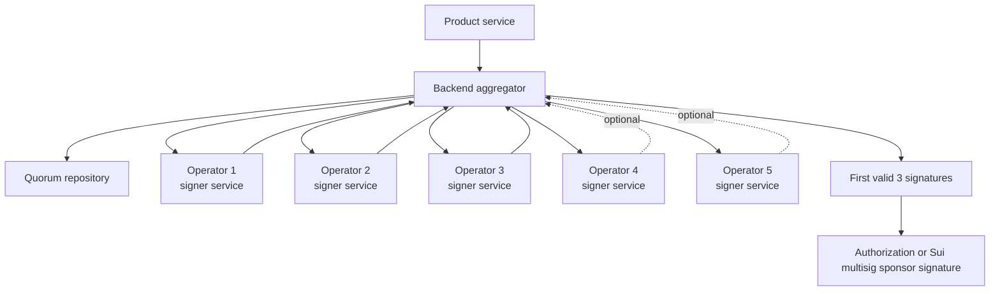
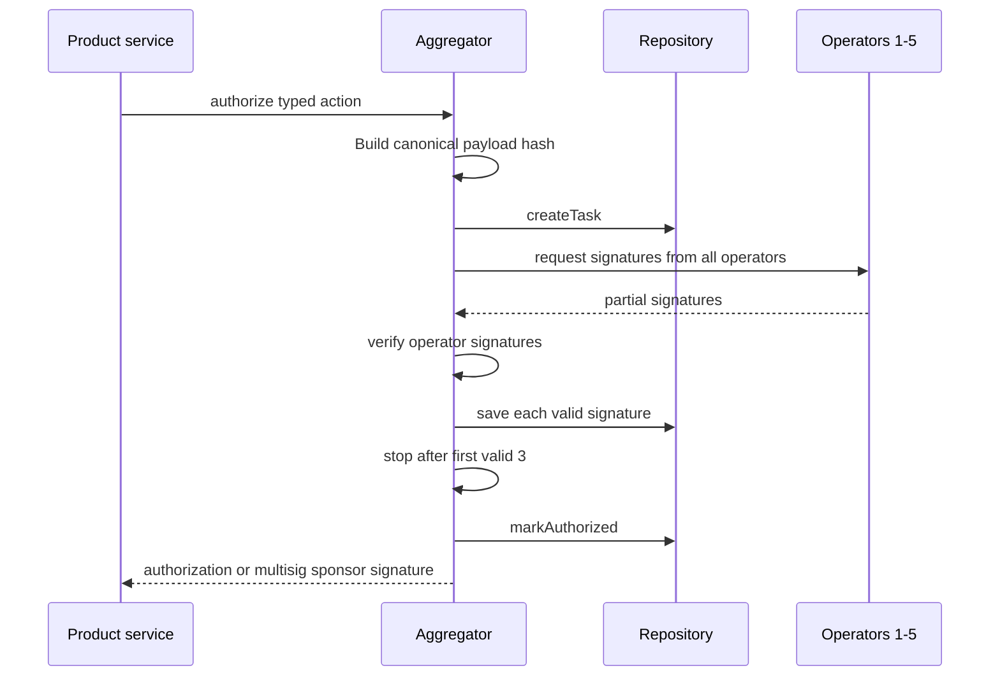

# 003 - AVS Authorization Boundary

## Goal

Define the AVS authorization boundary used by nearby payments.

The AVS boundary exists to avoid centralized backend signing. V1 provides a 3-of-5 validation and signing boundary for protocol-sensitive actions that should not be authorized by one backend process.

This document defines:

- what the AVS authorizes
- what the AVS must never authorize
- how backend services consume AVS authorization
- how synchronous and asynchronous quorum collection are handled
- how Sui contracts verify AVS authorizations
- when stores and workers are needed
- what is intentionally deferred to later architecture docs

## Grounding

The design is based on the following current platform facts:

- EigenLayer AVSs are a combination of onchain and offchain code. Operators register to an AVS and run AVS-specific offchain clients. See [Eigen AVS Book](https://eigenlabs.gitbook.io/avs-book/learn/eigenlayer-a-visual-guide/actors/avss).
- Common AVS implementations use an aggregator that accepts tasks, coordinates operators, stores task/result state, and checks quorum. See [Ava Protocol AVS overview](https://avaprotocol.org/docs/ethereum/EigenLayer-AVS/1-eigenlayer-avs-overview) and [Ava Protocol Aggregator](https://avaprotocol.org/docs/ethereum/EigenLayer-AVS/2-aggregator/).
- Operators commonly sign task results and send signatures back to an aggregator. AlignedLayer documents operators verifying work, signing true/false with BLS, and returning signatures to an aggregator. See [AlignedLayer Operator](https://docs.alignedlayer.com/architecture/1_proof_verification_layer/4_operator).
- Some AVS task models are explicitly asynchronous, with task response windows and threshold/quorum evaluation periods. See [Imua AVS Tasks](https://docs.imua.xyz/avs-setup/tasks-in-an-avs).
- Sui Move supports onchain verification for signature schemes including Ed25519, Secp256k1, Secp256r1, and BLS. See [Sui Signature Verification](https://docs.sui.io/guides/developer/cryptography/signing).
- Sui transaction authentication supports pure Ed25519, Secp256k1, Secp256r1, zkLogin, passkey, and multisig account signatures. Sui uses BLS for validator authority signatures, not as the normal account signature for sponsored transaction gas owners. See [Sui Transaction Authentication](https://docs.sui.io/concepts/transactions/transaction-auth).
- The Sui TypeScript SDK supports deterministic multisig address creation with `MultiSigPublicKey.fromPublicKeys`, threshold weights, and combining partial signatures with `combinePartialSignatures`. See [Sui SDK Multisig](https://sdk.mystenlabs.com/sui/cryptography/multisig).
- Sui transactions require gas paid in SUI. Sponsored transactions let a sponsor pay gas while preserving the user's transaction authority. User-controlled actions can remain user-signed while the protocol pays gas. See [Sui Sponsored Transactions](https://docs.sui.io/guides/developer/transactions/sponsor-txn).
- The Sui TypeScript SDK supports sponsored transaction construction by building transaction kind bytes, reconstructing the transaction, then setting sender, gas owner, and gas payment. See [Mysten TypeScript SDK Sponsored Transactions](https://sdk.mystenlabs.com/sui/transaction-building/sponsored-transactions).

## Core Principle

The AVS boundary starts as a Sui-native 3-of-5 operator quorum, not a full Eigen AVS.

The system should keep the code AVS-shaped from the beginning:

- typed tasks
- independent operators
- aggregator-owned repository
- threshold signatures
- async-capable result model
- no single backend signing key

V1 does not need external restaked operators. It needs a deterministic Sui multisig sponsor address and independent signer services that make a single-key compromise insufficient.

Full Eigen AVS integration can be introduced later when the product needs external operators, staking economics, slashing, and stronger decentralized security guarantees.

## Signing Principle

Operators sign typed action authorizations or exact sponsored transaction bytes after policy validation. They must never sign arbitrary transactions.

```text
Backend:
  request builder and optional transport

V1 quorum:
  3-of-5 independent Sui-compatible signer services

Sui contract:
  final verifier and executor

User:
  sole authority for user-owned actions
```

The backend must never be able to ask operators to sign arbitrary transaction bytes. Operators must only authorize allowlisted, domain-separated actions.

For self-custody user actions, the backend is never transaction authority. The client signs user-owned actions with zkLogin. When a transaction is sponsored, funding remains separate from authority as defined in `009-arch-transaction-funding`.

## Non-Goals

This document does not define:

- SuiNS parent custody contract internals
- leaf-name lifecycle rules
- user profile metadata
- Walrus storage
- payment settlement
- transaction funding policy
- backend auth mechanics
- operator reward or slashing economics

SuiNS name custody and profile rules belong in `004-arch-custodial-profiles`.

Transaction funding, sponsorship middleware, and gasless USDsui readiness belong in `009-arch-transaction-funding`.

## V1 Operator Model

The first production version uses a protocol-controlled 3-of-5 Sui multisig signer quorum.

This is not a full Eigen AVS yet. It is an AVS-style operator network with:

- five independent signer microservices
- each signer deployed to a different server/provider boundary
- each signer holding one Sui-compatible private key
- one deterministic Sui multisig public key/address derived from the five operator public keys
- threshold `3`
- weight `1` for every operator
- backend-owned aggregator repository that requests signatures and returns the first valid 3-of-5 quorum

The security goal is simple: one compromised backend process or one compromised signer cannot spend sponsor gas or authorize protocol-sensitive actions.

Trust model:

```text
trusted assumption:
  fewer than 3 of 5 operators are malicious or compromised at the same time

not trusted:
  any single operator
  the aggregator as a signer
  one backend instance
```

The aggregator may coordinate requests, store task state, and combine signatures. It must not hold an operator private key.



The deterministic sponsor address is created once from the signer set:

```ts
import type { PublicKey } from '@mysten/sui/cryptography';
import { MultiSigPublicKey } from '@mysten/sui/multisig';

export function createSponsorMultisigAddress(input: {
    operatorPublicKeys: [
        PublicKey,
        PublicKey,
        PublicKey,
        PublicKey,
        PublicKey,
    ];
}) {
    const publicKey = MultiSigPublicKey.fromPublicKeys({
        threshold: 3,
        publicKeys: input.operatorPublicKeys.map((publicKey) => ({
            publicKey,
            weight: 1,
        })),
    });

    return {
        publicKey,
        address: publicKey.toSuiAddress(),
    };
}
```

Signer set rotation changes the multisig address unless the sponsor account is abstracted by a contract. V1 should treat the signer set as stable and operationally protected. Rotation requires a planned gas-coin migration or later smart-account/custody abstraction.

## Full AVS Upgrade Path

The V1 signer quorum should preserve AVS-shaped interfaces so it can be upgraded later.

```text
V1:
  3-of-5 protocol-controlled signer services
  backend-owned aggregator repository
  Sui multisig sponsor address

V2:
  independent third-party operators
  operator registry
  external monitoring and signed attestations

V3:
  full Eigen AVS
  restaked operators
  slashing or reputation
  external economic security
```

Full AVS is justified when the system needs independent third-party operators and economic security. Until then, simple signer microservices give the main practical benefit: no single backend key can sponsor transactions.

## Allowed Actions

The AVS starts with a narrow action set.

```ts
export const AVS_ACTIONS = [
    'parent_name.renew',
    'parent_name.admin_recover',
    'leaf_name.register_initial',
    'sponsor_tx.approve',
] as const;

export type AvsAction = (typeof AVS_ACTIONS)[number];
```

Allowed action meanings:

- `parent_name.renew`
  - authorize renewal of the parent SuiNS name
- `parent_name.admin_recover`
  - authorize parent-level emergency recovery or custody repair
- `leaf_name.register_initial`
  - authorize initial registration of a leaf name to a user address
- `sponsor_tx.approve`
  - authorize gas sponsorship for a bounded protocol transaction

## Forbidden Actions

The AVS must never authorize user-owned leaf actions after initial registration.

Forbidden:

- `leaf_name.update_target`
- `leaf_name.revoke`
- `profile_metadata.update`
- `payment.transfer`
- arbitrary transaction signing
- arbitrary Sui object mutation

Post-registration leaf actions must be user-authorized and user-signed. The protocol may sponsor gas, but sponsorship must not replace user authority.

## Backend Integration

The AVS is an internal dependency of product services.

There is no client-facing AVS route in V1.

The client calls product routes:

```text
POST /v1/names
POST /v1/payment-intents
POST /v1/funding/deposit-routes
```

Product services call the AVS internally when an action requires decentralized authorization:

```text
route
-> strict Zod validation
-> auth middleware
-> product service
-> AVS client
-> authorization material
```

The AVS service belongs in backend code as an internal client/service:

```text
src/
  services/
    avs.ts
    operator-quorum.ts
  repositories/
    operator-quorum.ts
  schemas/
    avs.ts
    operator-quorum.ts
  types/
    avs.ts
    operator-quorum.ts
  constants/
    avs.ts
    operator-quorum.ts
  utils/
    avs.ts
```

No `routes/avs.ts` is needed unless an operator/admin surface is intentionally introduced later.

The aggregator owns the repository because the aggregator coordinates quorum state. Product services should call typed AVS/quorum methods, not individual operators directly.

## Strict Payload Validation

Every AVS input must pass strict Zod validation before the backend asks the AVS for authorization.

Rules:

- schemas are `.strict()`
- no unknown keys
- no implicit `null`
- no implicit `undefined`
- no empty strings as placeholders
- no backend normalization of action-critical fields
- no coercion for addresses, labels, nonces, timestamps, object IDs, package IDs, signatures, or hashes

The caller of the service is responsible for providing the exact structure.

```ts
export const leafRegistrationAvsInputSchema = z
    .object({
        label: z.string().min(1),
        parentName: z.string().min(1),
        leafName: z.string().min(1),
        userAddress: z.string().regex(/^0x[a-fA-F0-9]{64}$/),
        walletBindingHash: z.string().regex(/^0x[a-fA-F0-9]{64}$/),
        nonce: z.string().min(1),
        expiresAtMs: z.number().int().positive(),
    })
    .strict();
```

Do not use optional or nullable fields for action-critical data.

## Authorization Payload

Operators sign a canonical, domain-separated payload.

```ts
export type AvsAuthorizationPayload = {
    version: 1;
    domain: 'nearby-payments.avs.authorization';
    chain: 'sui:mainnet';
    action: AvsAction;
    targetPackage: string;
    targetObject: string;
    payloadHash: string;
    nonce: string;
    issuedAtMs: number;
    expiresAtMs: number;
};
```

The full domain action payload is hashed separately.

Example for initial leaf registration:

```ts
export type LeafRegistrationPayload = {
    label: string;
    parentName: string;
    leafName: string;
    userAddress: string;
    walletBindingHash: string;
};
```

Authorization hash:

```text
hash(
  "nearby-payments.avs.authorization"
  || canonical_bcs(AvsAuthorizationPayload)
)
```

The payload must include:

- action
- target package
- target object
- payload hash
- nonce
- issued time
- expiry
- chain domain

This prevents replay across actions, objects, packages, chains, and time windows.

## Authorization Result

The backend AVS client must support both immediate and pending results.

AVS quorum should not be assumed to be one-request/one-response at the operator-set level.

```ts
export type AvsAuthorizeResult =
    | {
          status: 'authorized';
          authorization: AvsAuthorization;
      }
    | {
          status: 'pending';
          taskId: string;
          retryAfterMs: number;
      }
    | {
          status: 'rejected';
          reason: string;
      };
```

The authorization returned to the product service or client transaction builder:

```ts
export type AvsAuthorization = {
    version: 1;
    action: AvsAction;
    payloadHash: string;
    nonce: string;
    expiresAtMs: number;
    threshold: {
        required: number;
        total: number;
    };
    signerSetId: string;
    signatureScheme: 'sui_multisig' | 'ecdsa_k1' | 'bls12381';
    signers: string[];
    aggregateSignature?: string;
    signatures?: string[];
};
```

## Operator Quorum Aggregator

The aggregator asks all five operators to sign the same canonical task and returns as soon as three valid signatures are collected.

The aggregator must:

- calculate the canonical payload hash before calling operators
- send the exact same signing payload to every operator
- verify every returned signature against the operator's registered public key
- reject duplicate operator signatures
- stop once threshold is met
- persist only minimal task state when the request becomes async
- never hold an operator private key



Operator signing request:

```ts
const baseOperatorSignRequestSchema = z
    .object({
        taskId: z.string().min(1),
        signerSetId: z.string().min(1),
        action: z.enum(AVS_ACTIONS),
        payloadHash: z.string().regex(/^0x[a-fA-F0-9]{64}$/),
        nonce: z.string().min(1),
        issuedAtMs: z.number().int().positive(),
        expiresAtMs: z.number().int().positive(),
    });

export const operatorSignRequestSchema = z.discriminatedUnion('kind', [
    baseOperatorSignRequestSchema
        .extend({
            kind: z.literal('authorization'),
        })
        .strict(),
    baseOperatorSignRequestSchema
        .extend({
            kind: z.literal('sponsored_transaction'),
            transactionBytesHash: z.string().regex(/^0x[a-fA-F0-9]{64}$/),
        })
        .strict(),
]);

export type OperatorSignRequest = z.infer<typeof operatorSignRequestSchema>;

export type OperatorSignature = {
    operatorId: string;
    signature: string;
};
```

`transactionBytesHash` is present only for `sponsored_transaction`. Pure authorization tasks use the `authorization` variant and cannot carry transaction bytes.

Repository shape:

```ts
export interface OperatorQuorumRepository {
    createTask(input: {
        taskId: string;
        signerSetId: string;
        action: AvsAction;
        payloadHash: string;
        nonce: string;
        expiresAtMs: number;
    }): Promise<void>;

    saveSignature(input: {
        taskId: string;
        operatorId: string;
        signature: string;
    }): Promise<void>;

    markAuthorized(input: {
        taskId: string;
        signatures: OperatorSignature[];
    }): Promise<void>;

    markRejected(input: {
        taskId: string;
        reason: string;
    }): Promise<void>;
}
```

Aggregator shape:

```ts
export function collectFirstThresholdSignatures(input: {
    request: OperatorSignRequest;
    operators: readonly OperatorClient[];
    threshold: 3;
    repository: OperatorQuorumRepository;
    signal: AbortSignal;
}): Promise<OperatorSignature[]> {
    return new Promise((resolve, reject) => {
        const signatures: OperatorSignature[] = [];
        const seen = new Set<string>();
        let completed = 0;
        let settled = false;

        const rejectIfDone = async () => {
            if (settled || completed < input.operators.length) {
                return;
            }

            settled = true;
            await input.repository.markRejected({
                taskId: input.request.taskId,
                reason: 'threshold_not_met',
            });
            reject(new Error('threshold_not_met'));
        };

        void input.repository
            .createTask({
                taskId: input.request.taskId,
                signerSetId: input.request.signerSetId,
                action: input.request.action,
                payloadHash: input.request.payloadHash,
                nonce: input.request.nonce,
                expiresAtMs: input.request.expiresAtMs,
            })
            .then(() => {
                for (const operator of input.operators) {
                    void operator
                        .sign(input.request, input.signal)
                        .then(async (result) => {
                            if (settled || seen.has(result.operatorId)) {
                                return;
                            }

                            await operator.verifySignature(input.request, result);

                            seen.add(result.operatorId);
                            signatures.push(result);
                            await input.repository.saveSignature({
                                taskId: input.request.taskId,
                                operatorId: result.operatorId,
                                signature: result.signature,
                            });

                            if (signatures.length >= input.threshold) {
                                settled = true;
                                const quorum = signatures.slice(0, input.threshold);
                                await input.repository.markAuthorized({
                                    taskId: input.request.taskId,
                                    signatures: quorum,
                                });
                                resolve(quorum);
                            }
                        })
                        .catch(() => {
                            // Individual operator failures do not fail the task unless quorum becomes impossible.
                        })
                        .finally(() => {
                            completed += 1;
                            void rejectIfDone();
                        });
                }
            })
            .catch(reject);
    });
}
```

Implementation note: production code should use a small concurrency helper that aborts outstanding operator requests once quorum is reached and records operator failure reasons for monitoring. The snippet shows the contract shape, not a complete cancellation library.

## Multisig Sponsor Signature

For sponsored Sui transactions, the operator quorum must produce a Sui multisig sponsor signature, not only an Eigen-style attestation.

```ts
import { MultiSigPublicKey } from '@mysten/sui/multisig';

export function combineSponsorSignatures(input: {
    sponsorPublicKey: MultiSigPublicKey;
    signatures: [string, string, string];
}) {
    return input.sponsorPublicKey.combinePartialSignatures(input.signatures);
}
```

Final transaction submission includes both user and sponsor signatures:

```ts
export async function submitWithMultisigSponsor(input: {
    client: SuiClient;
    transactionBytes: Uint8Array;
    userSignature: string;
    sponsorMultisigSignature: string;
}) {
    return input.client.executeTransactionBlock({
        transactionBlock: input.transactionBytes,
        signature: [input.userSignature, input.sponsorMultisigSignature],
        options: {
            showEffects: true,
            showObjectChanges: true,
        },
    });
}
```

The aggregator may assemble and return the sponsor multisig signature. It must not sign as the sponsor itself.

## Synchronous Path

Use the synchronous path only when the aggregator can collect quorum within the product request timeout.

```text
product service
-> AVS client authorize()
-> authorized
-> return authorization material
-> optionally return multisig sponsor signature for sponsored transaction tasks
-> client signs and submits, or backend relays an already signed transaction
-> return result
```

This is the preferred path for initial leaf registration if quorum latency is consistently low.

If the AVS returns `pending`, the service must not block indefinitely.

## Asynchronous Path

Use the asynchronous path when quorum collection may outlive the request timeout.

```text
product service
-> AVS client authorize()
-> pending taskId
-> persist minimal operation state
-> return 202 or queue continuation
-> worker polls/completes task
-> return authorization material or multisig sponsor signature
-> client signs and submits, or backend relays an already signed transaction
-> emit completion event
```

The async path is required for:

- long AVS response windows
- unreliable operator availability
- parent renewal automation
- retries after aggregator timeout
- supportable operational recovery

## Store Policy

No AVS store is required for the pure synchronous V1 path.

A store is introduced only when the system needs durable async task state, idempotency across retries, or auditability that cannot be provided by onchain events and logs.

If introduced, the store must keep minimal operational data only.

```sql
create table avs_authorization_tasks (
  id text primary key,
  action text not null,
  payload_hash text not null,
  nonce text not null unique,
  status text not null check (status in ('pending', 'authorized', 'rejected', 'expired')),
  issued_at integer not null,
  expires_at integer not null,
  created_at integer not null,
  updated_at integer not null
);
```

Do not store profile metadata, display names, avatars, bios, or full user profile payloads in backend storage.

## Worker Policy

No AVS worker is required for the pure synchronous V1 user flow.

A worker is introduced only for:

- async quorum completion
- parent name renewal cron
- retrying aggregator timeouts
- reconciling submitted Sui transactions
- anomaly delivery for failed protocol actions

Workers must load minimal task state and must not become a second application layer.

## Sui Contract Verification

The Sui contract is the final verifier.

It must verify:

```text
1. action is allowlisted
2. payload hash matches expected action payload
3. authorization has not expired
4. nonce has not been used
5. signer set is active
6. threshold is met
7. signatures verify
8. requested mutation matches action
```

Conceptual Move shape:

```move
public fun verify_avs_authorization(
    config: &AvsConfig,
    action: vector<u8>,
    payload_hash: vector<u8>,
    nonce: vector<u8>,
    expires_at_ms: u64,
    signatures: vector<vector<u8>>,
    clock: &Clock,
): bool {
    // expiry
    // nonce replay
    // action allowlist
    // active signer set
    // signature verification
    // threshold check
}
```

The contract must not accept backend signatures as a replacement for AVS authorization.

## AVS Client Shape

The backend client exposes typed methods, not a generic signer.

```ts
export function createAvsClient(env: Env, options: CreateAppOptions = {}) {
    return {
        async authorizeLeafRegistration(input: LeafRegistrationAvsInput): Promise<AvsAuthorizeResult> {
            const parsed = leafRegistrationAvsInputSchema.parse(input);
            const payload = buildLeafRegistrationPayload(parsed);

            return requestThresholdAuthorization(env.AVS_ENDPOINT, {
                action: 'leaf_name.register_initial',
                payload,
            });
        },

        async authorizeParentRenewal(input: ParentRenewalAvsInput): Promise<AvsAuthorizeResult> {
            const parsed = parentRenewalAvsInputSchema.parse(input);
            const payload = buildParentRenewalPayload(parsed);

            return requestThresholdAuthorization(env.AVS_ENDPOINT, {
                action: 'parent_name.renew',
                payload,
            });
        },
    };
}
```

There should be no method like:

```ts
signTransaction(bytes: Uint8Array)
```

Generic signing defeats the AVS boundary.

## Leaf Registration Dependency

The SuiNS custody doc consumes this AVS boundary.

`004-arch-custodial-profiles` should require:

```text
initial leaf registration:
  AVS authorization required

parent renewal:
  AVS authorization required

parent admin recovery:
  AVS authorization required

post-registration leaf update:
  user signature required
  AVS authorization forbidden

leaf revoke:
  user signature required
  AVS authorization forbidden
```

This keeps the AVS from becoming a parent-controlled backdoor over user leaf names.

## Backend Responsibilities

The backend may:

- build typed AVS authorization requests
- call the AVS aggregator/client
- request sponsor approval for bounded protocol transactions
- relay already user-signed Sui transactions
- submit protocol-owned parent transactions when authorized by AVS
- log operational failures
- retry async task completion when needed

The backend must not:

- issue unilateral authorizations
- store profile PII
- mutate user leaf names without user signatures
- ask the AVS to sign arbitrary transaction bytes
- treat AVS approval as a replacement for user consent
- tie user transaction authority to backend sponsorship
- block user-owned actions solely because the gas sponsor is unavailable

## Transaction Funding Boundary

The AVS may authorize `sponsor_tx.approve` for bounded protocol actions, but it does not own transaction funding policy.

Funding policy belongs in `009-arch-transaction-funding`.

AVS-specific rules:

- AVS authorization is not a replacement for user consent
- AVS must never sign arbitrary transaction bytes
- AVS may approve sponsor eligibility only for allowlisted action payloads
- sponsored user-owned actions still require the user signature
- unavailable sponsorship must not block valid user-paid actions when the contract permits them

## Monitoring

Track:

- AVS authorization latency
- AVS pending rate
- AVS rejection rate
- quorum timeout rate
- invalid signature responses
- expired authorization attempts
- nonce replay attempts
- Sui contract AVS verification failures
- parent renewal deadline
- async task failures

Operator-actionable failures should emit anomaly events.

## Testing Rules

Tests must cover:

- strict schema rejects unknown keys
- strict schema rejects missing action-critical values
- strict schema rejects `null` / `undefined` request fields
- AVS client cannot request forbidden actions
- AVS client has no generic transaction signing method
- synchronous authorized result builds expected transaction input
- pending result does not block indefinitely
- rejected result maps to typed service error
- Sui verifier rejects expired authorization
- Sui verifier rejects nonce replay
- Sui verifier rejects insufficient signatures
- Sui verifier rejects wrong action for payload hash

## Open Questions

- Should V1 operators use Ed25519, Secp256k1, or Secp256r1 keys for the Sui multisig signer set?
- What is the maximum acceptable quorum wait for user-facing flows?
- Should parent renewal be fully cron-driven or manually triggered by operators/admins?
- How will signer set rotation be represented on Sui?
- What exact payload encoding should be used: BCS, JSON canonicalization, or another deterministic format?

## Review Checklist

Before using AVS authorization in a feature, verify:

- Is the action explicitly allowlisted?
- Is the payload strict and domain-separated?
- Is the action forbidden if it touches user-owned leaf state?
- Can the Sui contract verify the authorization independently?
- Is the backend only building, transporting, or aggregating signatures?
- Is funding independent of user transaction authority?
- Can the client fall back to user-paid submission when sponsorship is unavailable?
- Is async quorum handled without blocking indefinitely?
- Is backend storage avoided unless async state truly requires it?
- Are profile data and PII excluded from AVS task persistence?
