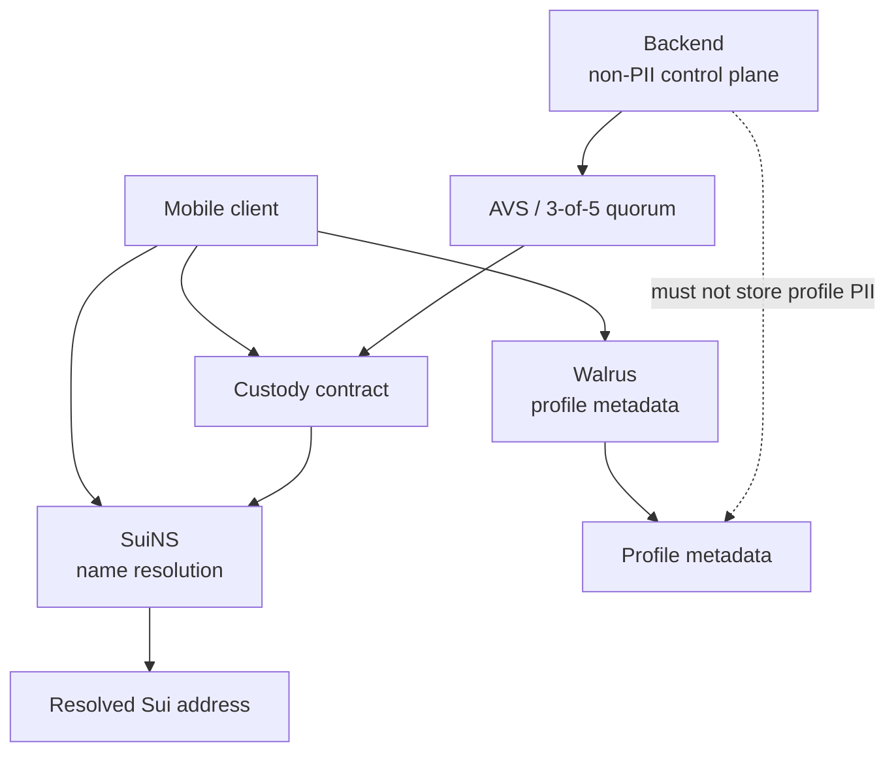
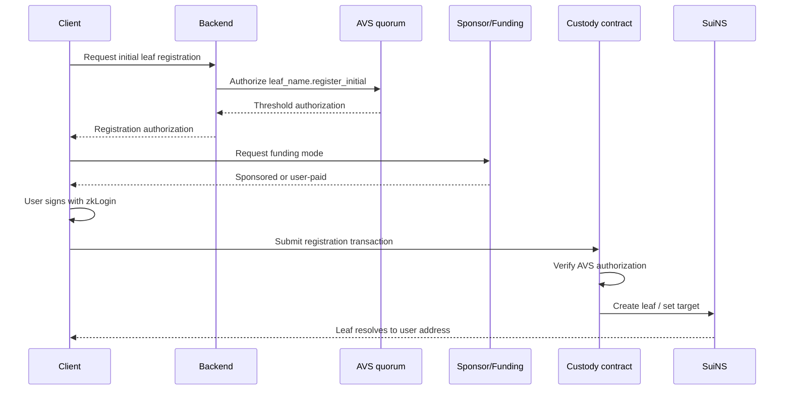

# 004 - Custodial Profiles And SuiNS Names

## Goal

Define the SuiNS name and profile model for nearby payments.

This document covers:

- parent SuiNS custody
- leaf name registration
- user-controlled leaf mutation
- gas sponsorship boundaries
- Walrus profile metadata
- backend non-custody and non-PII constraints
- dependency on AVS authorization from `003-arch-avs`

## Core Principle

Profiles are not backend records.

```text
SuiNS:
  name -> Sui address

Custody contract:
  parent custody and leaf policy enforcement

AVS:
  parent-level and initial-registration authorization

User:
  post-registration leaf authority

Walrus:
  profile metadata source of truth

Backend:
  auth/session infrastructure, request transport, sponsorship, and operational glue
```

The backend must not store profile information.



## Grounding

The design is based on the following current platform facts:

- SuiNS names are represented by NFTs/capabilities used to mutate records. The NFT is not itself the resolution method. See [SuiNS Developer Guide](https://docs.suins.io/developer).
- Leaf subnames are controlled through the active parent. They do not carry their own NFT in the same way as node subnames. See [SuiNS Developer Guide](https://docs.suins.io/developer).
- Enoki Identity Subnames demonstrates a production-style custody pattern where a domain can be transferred into a managed contract that borrows it to create/delete subnames. See [Enoki Identity Subnames](https://docs.enoki.mystenlabs.com/subnames).
- Sui supports sponsored transactions, where a sponsor pays gas while the user remains the authority for user-owned actions. See [Sui Sponsored Transactions](https://docs.sui.io/concepts/transactions/sponsored-transactions).
- Walrus is decentralized storage for blobs and metadata. Profile content should live in Walrus, not in backend database tables.

## Non-Goals

This document does not define:

- OAuth / zkLogin session bootstrap
- App Attest request binding
- Nearby local handshake auth
- AVS operator implementation
- payment settlement
- Bridge/KYC funding flows

Auth is defined in `002-arch-auth`.
AVS authorization is defined in `003-arch-avs`.

## Privacy And NDPR Constraint

The backend must not store profile PII.

Forbidden backend storage:

- display name
- avatar URL
- avatar image
- bio
- profile JSON
- Walrus profile JSON body
- user-readable profile labels beyond what is strictly required in transient request handling
- profile cache keyed by user identity

Allowed backend storage is limited to auth and operational state already required by other docs:

- `userId`
- OAuth identity binding
- device/session records
- App Attest records
- wallet binding / Sui address
- operational request IDs
- non-PII hashes for idempotency or AVS payload verification, when required

Source of truth:

```text
SuiNS:
  active name resolution

Sui custody contract:
  parent custody state, leaf owner state, lifecycle events

Walrus:
  profile metadata content

Sui events / objects:
  auditable lifecycle history
```

## Name Model

The app uses a parent SuiNS name controlled by the protocol.

Example:

```text
parent:
  nearby.sui

leaf:
  alice@nearby.sui
```

Product requirements:

- users get names freely
- users do not pay name fees
- users do not pay gas for app-driven name registration and leaf actions when sponsorship is available
- leaf names have no app-level expiration unless revoked by the user
- parent renewal is a protocol responsibility
- post-registration leaf control belongs to the user

## Custody Model

The custody contract owns or controls the parent SuiNS name capability.

```text
parent SuiNS NFT/capability
-> held by NearbyNameCustody contract/object
-> governed by AVS authorization for parent actions
```

The AVS/multisig boundary may authorize:

- parent renewal
- parent emergency recovery
- initial leaf registration

The AVS/multisig boundary must not authorize:

- existing leaf target update
- existing leaf revoke
- profile metadata update
- reassignment of a user leaf

After initial registration, the user is the only authority for leaf actions.

## Leaf Registration

Initial leaf registration is protocol-assisted.

Flow:

```text
1. user completes backend auth from 002
2. client requests a leaf label
3. backend validates request shape and basic availability inputs
4. backend asks AVS for `leaf_name.register_initial`
5. AVS returns authorization or pending task
6. client builds/verifies registration transaction using AVS authorization
7. protocol sponsors gas when available
8. user signs with zkLogin
9. client submits directly or backend relays already signed transaction
10. custody contract creates leaf and records user as leaf owner
```



Initial registration requires AVS authorization because the contract owns the parent.

The AVS authorization must include:

- parent name
- leaf label
- full leaf name
- user Sui address
- target custody contract/object
- nonce
- expiry
- payload hash

The custody contract must reject registration if:

- AVS authorization is missing
- AVS authorization is expired
- AVS threshold is invalid
- label is already registered or tombstoned
- target user address does not match the authorization payload
- nonce was already used

## Post-Registration Leaf Actions

Post-registration leaf actions are user-only.

Allowed user actions:

- update leaf target address
- update metadata pointer, if supported by the final SuiNS/profile design
- revoke leaf
- rotate linked address through a user-signed flow

Forbidden AVS/backend actions:

- update existing user leaf target
- revoke existing user leaf
- reassign existing user leaf
- update user profile metadata

User-only action flow:

```text
1. client builds leaf action transaction
2. user signs with zkLogin
3. protocol may sponsor gas
4. if sponsor is unavailable, client falls back to user-paid gas
5. client submits directly or backend relays already signed transaction
6. custody contract verifies sender/user signature
7. custody contract mutates leaf state
```

Backend sponsorship must not be required for user-owned leaf actions.

## Sponsorship Boundary

Sponsorship is gas-only.

For user-owned leaf actions:

```text
preferred:
  user signs
  protocol sponsors gas
  client submits or backend relays

fallback:
  user signs
  user pays gas
  client submits directly to Sui
```

The backend may refuse sponsorship for abuse, risk, or policy reasons. Refusing sponsorship must not revoke user authority when the contract permits the action.

Name sponsorship policy:

```text
initial leaf registration:
  sponsored by protocol when available

post-registration leaf target update:
  sponsored by protocol when initiated from the app

leaf revoke:
  sponsored by protocol when initiated from the app

metadata pointer update:
  sponsored by protocol when initiated from the app
```

All of these actions remain user-authorized where the leaf is user-owned. Sponsorship pays gas only.

For parent-owned actions:

```text
parent renewal:
  AVS authorization required
  protocol pays gas

parent recovery:
  AVS authorization required
  protocol pays gas
```

Users are not authority for parent actions.

## Parent Renewal

Parent renewal is a protocol responsibility.

The custody contract should expose a renewal path that can be called by protocol automation or operators after AVS authorization.

Renewal requirements:

- AVS authorization for `parent_name.renew`
- parent capability held by custody contract
- payment/gas funded by protocol
- public or operator-triggered execution
- renewal event emitted onchain

The renewal path should not grant control over user leaf names.

Monitoring must track parent expiration windows and emit anomalies before renewal becomes urgent.

## Walrus Metadata

Profile metadata lives in Walrus.

Walrus metadata may include:

- display name
- avatar
- profile image hash
- profile preferences
- public profile content

Backend must not store this payload.

The onchain/profile pointer may store:

- Walrus blob ID
- metadata hash
- metadata version
- updated timestamp

The client reads profile metadata from Walrus and verifies it against the onchain pointer or signed user update.

## Interoperability

SuiNS remains the ecosystem-readable layer.

Other Sui apps should be able to resolve:

```text
alice@nearby.sui -> 0xUser
```

Nearby-specific guarantees require checking the custody contract:

```text
leaf is active
leaf owner is user
leaf was initially registered with AVS authorization
leaf has not been revoked
metadata pointer is current
```

Local nearby auth from `002-arch-auth` verifies:

```text
SuiNS resolves name to address
device credential binds name and address
local transcript signs name and address
```

## Backend Responsibilities

The backend may:

- validate request shape with strict Zod schemas
- perform auth and App Attest checks from `002`
- request AVS authorization from `003`
- sponsor gas when policy allows
- relay already user-signed transactions
- read public SuiNS/Walrus/onchain state for response assembly
- return public pointers or transaction status

The backend must not:

- store profile PII
- store profile metadata JSON
- store avatars
- become source of truth for names
- mutate user leaf names without user signatures
- block valid user-paid leaf actions because sponsorship is unavailable
- provide a backend-only revoke path
- provide a backend-only reassignment path

## Strict Request Validation

All profile/name backend routes must use strict Zod validation.

Rules:

- `.strict()` schemas
- no unknown keys
- no implicit `null`
- no implicit `undefined`
- no backend normalization of labels, names, addresses, signatures, or metadata pointers
- no coercion for action-critical fields

Example:

```ts
export const claimNameRequestSchema = z
    .object({
        label: z.string().min(1),
        userAddress: z.string().regex(/^0x[a-fA-F0-9]{64}$/),
        nonce: z.string().min(1),
        expiresAtMs: z.number().int().positive(),
    })
    .strict();
```

The client must provide the exact payload shape.

## Backend Storage

No profile table.

No backend profile cache.

No backend avatar table.

No backend profile metadata table.

If async AVS or sponsorship requires operational state, store only non-PII hashes and statuses.

Example allowed operational table:

```sql
create table name_operation_tasks (
  id text primary key,
  action text not null,
  payload_hash text not null,
  nonce text not null unique,
  status text not null check (status in ('pending', 'authorized', 'submitted', 'failed', 'expired')),
  created_at integer not null,
  updated_at integer not null
);
```

Do not store:

- label
- full SuiNS name
- avatar
- display name
- profile metadata JSON

If label/name observability is needed, use Sui events or operator tooling against public chain state.

Use idempotency keys for name registration and sponsored leaf actions. If name registration or leaf action volume becomes high enough to affect request latency or sponsor admission, queue the sponsorship/submission work while preserving user signature and idempotency.

## Contract Events

The custody contract should emit events for public lifecycle tracking.

Suggested events:

```text
LeafRegistered {
  leaf_hash,
  owner,
  target,
  metadata_pointer_hash
}

LeafTargetUpdated {
  leaf_hash,
  owner,
  new_target
}

LeafRevoked {
  leaf_hash,
  owner
}

ParentRenewed {
  parent_hash,
  renewed_until_ms
}
```

Events should avoid unnecessary PII. Prefer hashes where public readability is not required for interoperability.

## Monitoring

Track:

- parent renewal deadline
- failed parent renewal attempts
- failed initial leaf registration
- AVS authorization failures for leaf registration
- sponsorship failures
- fallback-to-user-paid rate
- SuiNS resolution mismatches
- Walrus metadata pointer verification failures
- suspicious rapid leaf target changes
- unexpected parent custody state changes

Operator-actionable failures should emit anomaly events.

## Testing Rules

Tests must cover:

- backend rejects malformed claim payloads at strict Zod boundary
- backend does not persist profile metadata
- backend does not persist labels/full names in operational task state
- initial leaf registration requires AVS authorization
- initial leaf registration rejects expired AVS authorization
- initial leaf registration rejects nonce replay
- post-registration target update rejects AVS-only authorization
- post-registration target update requires user signature
- revoke requires user signature
- sponsorship failure allows user-paid fallback
- parent renewal requires AVS authorization
- parent renewal cannot mutate user leaf state

## Open Questions

- Exact SuiNS Move entry points for contract-held parent leaf creation/update/revoke.
- Whether metadata pointer should live in SuiNS records, a custody contract object, or a separate profile object.
- Whether labels should be emitted publicly or only hashes should be emitted.
- Tombstone policy for revoked names.
- Whether a revoked name can ever be reclaimed.
- Whether Walrus metadata updates should be represented as Sui events, Sui objects, or SuiNS text/content records.

## Review Checklist

Before implementing profile/name logic, verify:

- Is the backend avoiding profile PII storage?
- Is onchain/Walrus the source of truth?
- Does initial leaf registration require AVS authorization?
- Are post-registration leaf actions user-only?
- Is sponsorship gas-only?
- Can the client fall back to user-paid gas for user-owned actions?
- Does the custody contract prevent AVS/backend mutation of user leaves?
- Is parent renewal isolated from leaf control?
- Are strict schemas rejecting malformed payloads?
- Are custody/profile assumptions separate from auth and AVS docs?
