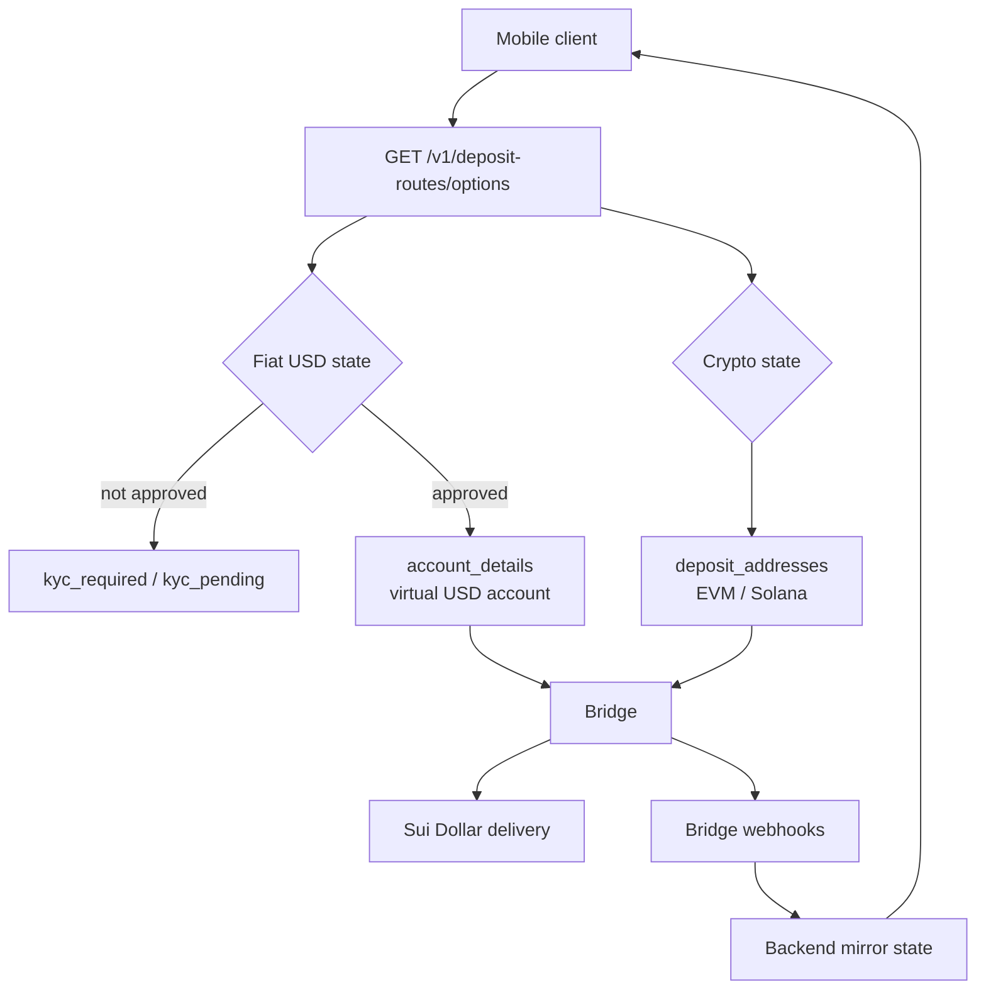
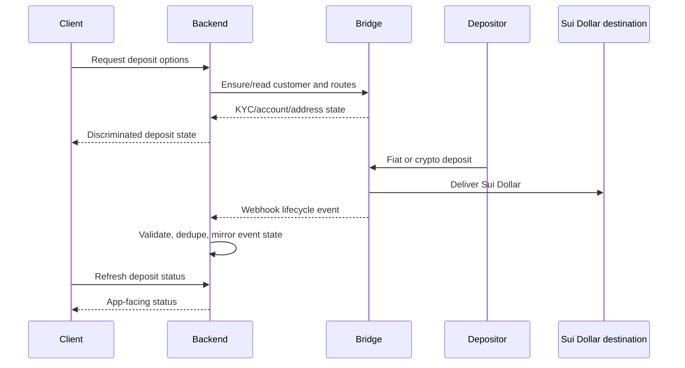

# 005 - Deposit Routes

## Goal

Define deposit route architecture for funding Sui Dollar balances.

The product supports two deposit route families:

- fiat USD deposits through Bridge virtual accounts
- crypto deposits through Bridge liquidation addresses on Solana and selected EVM chains

The API should stay small. The client asks for deposit options and receives a strict discriminated response that tells it exactly what to show.

## Grounding

The design is based on the following current Bridge facts:

- Bridge virtual accounts are permanent reusable fiat deposit addresses that convert incoming fiat into crypto and deliver it to a configured destination. Bridge requires customers to be KYC/KYB-approved before creating virtual accounts. See [Bridge Virtual Accounts](https://apidocs.bridge.xyz/platform/orchestration/virtual_accounts/virtual-account).
- Bridge KYC Links provide hosted KYC/KYB and Terms of Service flows. KYC statuses include states such as `not_started`, `incomplete`, `under_review`, `approved`, `rejected`, `paused`, and `offboarded`. See [Bridge KYC Links](https://apidocs.bridge.xyz/platform/customers/customers/kyclinks).
- Bridge recommends checking both customer `kyc_status` and endorsement status to determine platform eligibility. See [Bridge Customers API](https://apidocs.bridge.xyz/platform/customers/customers/api).
- Bridge liquidation addresses are permanent crypto deposit routes. When a customer sends crypto such as USDC to the liquidation address, Bridge automatically sends funds to the configured destination. See [Bridge Liquidation Address](https://apidocs.bridge.xyz/platform/orchestration/liquidation_address/liquidation_address).
- Bridge multichain liquidation addresses can accept USDC across supported EVM chains using `chain = "evm"`, but this feature requires Bridge account-manager enablement. See [Bridge Multichain Liquidation Addresses](https://apidocs.bridge.xyz/platform/orchestration/liquidation_address/multi-chain-currency).
- Bridge virtual account events include `funds_received`, `payment_submitted`, `payment_processed`, `in_review`, `refunded`, and other lifecycle states. Bridge notes that `payment_submitted` may include a preliminary transaction hash and `payment_processed` means payment confirmed on-chain and final. See [Bridge Virtual Account Events](https://apidocs.bridge.xyz/platform/orchestration/virtual_accounts/virtual-account-events).

## Core Principle

The client should not infer deposit state from partial fields.

The server returns discriminated unions:

```text
kyc_required:
  route user to hosted KYC / ToS

kyc_pending:
  show submitted/pending verification state

account_details:
  show virtual USD account details

deposit_addresses:
  show crypto deposit addresses
```

No nullable response fields.
No optional fields for state-critical data.
If the shape changes, the `kind` changes.

Bridge owns the deposit delivery lifecycle. The backend does not run independent deposit settlement or credit reconciliation. It mirrors Bridge route/event state and exposes strict app-facing states.



## Non-Goals

This document does not define:

- user wallet creation
- Sui Dollar settlement mechanics inside Bridge
- P2P nearby payment flows
- profile/SuiNS custody
- withdrawal or offramp flows
- direct KYC data collection by our backend
- independent backend deposit credit ledger

There is no withdrawal product in this architecture.

## Product Surface

Use one app-facing read route for client options:

```text
GET /v1/deposit-routes/options
```

The response contains separate fiat and crypto states:

```ts
export type DepositOptionsResponse = {
    fiatUsd: FiatUsdDepositState;
    crypto: CryptoDepositState;
};
```

This avoids mixing fiat KYC lifecycle with crypto address availability.

## Fiat USD Deposit State

Fiat USD deposits use Bridge virtual accounts and require hosted KYC.

```ts
export type FiatUsdDepositState =
    | {
          kind: 'kyc_required';
          bridgeKycLinkId: string;
          kycUrl: string;
          tosUrl: string;
          status: 'not_started' | 'incomplete' | 'rejected' | 'paused' | 'offboarded';
      }
    | {
          kind: 'kyc_pending';
          bridgeKycLinkId: string;
          status: 'under_review' | 'awaiting_questionnaire' | 'awaiting_ubo';
      }
    | {
          kind: 'account_details';
          account: {
              id: string;
              currency: 'usd';
              rails: Array<'ach_push' | 'wire'>;
              bankName: string;
              accountNumberLast4: string;
              routingNumber: string;
              accountHolderName: string;
          };
      };
```

The client behavior is direct:

```text
kyc_required:
  open hosted KYC / ToS links

kyc_pending:
  show pending review state

account_details:
  show USD account details
```

## Crypto Deposit State

Crypto deposits use Bridge liquidation addresses.

```ts
export type CryptoDepositState = {
    kind: 'deposit_addresses';
    routes: CryptoDepositRoute[];
};

export type CryptoDepositRoute =
    | {
          rail: 'evm';
          currency: 'usdc';
          address: `0x${string}`;
          supportedChains: Array<
              'ethereum' | 'base' | 'polygon' | 'arbitrum' | 'optimism' | 'avalanche_c_chain'
          >;
      }
    | {
          rail: 'solana';
          currency: 'usdc' | 'usdt';
          address: string;
          memoRequired: false;
      };
```

If Bridge later enables memo-based routes, model them as a separate union member.

```ts
export type MemoDepositRoute = {
    rail: 'stellar';
    currency: 'usdc';
    address: string;
    memoRequired: true;
    memo: string;
};
```

Do not expose `memo?: string`.

## Strict Zod Schemas

All route inputs and outputs must be strict.

No nullable or undefined fields for state-critical data.

```ts
export const fiatUsdDepositStateSchema = z.discriminatedUnion('kind', [
    z
        .object({
            kind: z.literal('kyc_required'),
            bridgeKycLinkId: z.string().min(1),
            kycUrl: z.url(),
            tosUrl: z.url(),
            status: z.enum(['not_started', 'incomplete', 'rejected', 'paused', 'offboarded']),
        })
        .strict(),

    z
        .object({
            kind: z.literal('kyc_pending'),
            bridgeKycLinkId: z.string().min(1),
            status: z.enum(['under_review', 'awaiting_questionnaire', 'awaiting_ubo']),
        })
        .strict(),

    z
        .object({
            kind: z.literal('account_details'),
            account: z
                .object({
                    id: z.string().min(1),
                    currency: z.literal('usd'),
                    rails: z.array(z.enum(['ach_push', 'wire'])).min(1),
                    bankName: z.string().min(1),
                    accountNumberLast4: z.string().length(4),
                    routingNumber: z.string().min(1),
                    accountHolderName: z.string().min(1),
                })
                .strict(),
        })
        .strict(),
]);
```

Bridge provider responses may contain nulls. Provider parsing belongs in `services/bridge.ts`, where Bridge responses are adapted into our strict internal types.

Our app-facing API must not leak provider nullability.

## Fiat USD Lifecycle

### Options Request

```text
client
-> GET /v1/deposit-routes/options
-> auth(low)
-> deposit route service
-> Bridge customer/KYC/virtual account state
-> discriminated response
```

The read route may lazily ensure provider routes. If an implementation treats provider creation as too sensitive for low fidelity, split creation into explicit high-fidelity routes instead of weakening the auth boundary implicitly.

### No Bridge Customer

If no Bridge customer or KYC link exists:

```text
create Bridge hosted KYC link
store Bridge IDs only
return kyc_required
```

The backend must not collect or store KYC PII.

### KYC Not Approved

Fetch Bridge customer or KYC link state.

Map Bridge statuses into client states:

```text
not_started / incomplete / rejected / paused / offboarded:
  kyc_required

under_review / awaiting_questionnaire / awaiting_ubo:
  kyc_pending

approved + base endorsement active:
  eligible for virtual account
```

Use both Bridge `kyc_status` and endorsement status for eligibility.

### KYC Approved

If eligible:

```text
ensure USD virtual account exists
destination = Sui Dollar delivery destination
return account_details
```

Before implementation, confirm Bridge account support for the exact Sui Dollar destination rail/currency.

## Crypto Deposit Lifecycle

Crypto routes do not use the fiat hosted KYC branch in this product model.

The backend ensures liquidation addresses for:

```text
EVM USDC
Solana USDC
Solana USDT
```

The destination is the user's Sui Dollar address or Bridge-supported Sui Dollar delivery route.

If Bridge account support for direct Sui Dollar delivery is unavailable, this doc must be revised before implementation.

Crypto deposit sponsorship is handled by Bridge's deposit route lifecycle. The backend does not separately sponsor crypto deposit transfers.



## Service Shape

The service should be small and compositional.

```ts
export function createDepositRouteService(env: Env, options: CreateAppOptions = {}) {
    const bridge = options.bridgeClient ?? createBridgeClient(env);
    const bridgeStore = createBridgeLinkStore(env);
    const routeStore = createDepositRouteStore(env);
    const walletStore = createWalletStore(env);

    return {
        async getOptions(userId: string): Promise<DepositOptionsResponse> {
            const [fiatUsd, crypto] = await Promise.all([
                getFiatUsdDepositState({ userId, bridge, bridgeStore, routeStore, walletStore }),
                getCryptoDepositState({ userId, bridge, routeStore, walletStore }),
            ]);

            return { fiatUsd, crypto };
        },
    };
}
```

The route remains thin:

```ts
routes.get('/options', auth('low'), async (c) => {
    const session = c.get('session');
    const result = await createDepositRouteService(c.env).getOptions(session.userId);
    return c.json(result);
});
```

If route creation is split from reads, use:

```text
GET  /v1/deposit-routes/options      -> auth(low)
POST /v1/deposit-routes/fiat-usd     -> auth(high)
POST /v1/deposit-routes/crypto       -> auth(high)
```

## Fiat Service Logic

```ts
async function getFiatUsdDepositState(input: DepositContext): Promise<FiatUsdDepositState> {
    const link = await input.bridgeStore.getByUserId(input.userId);

    if (!link?.bridgeCustomerId || !link.bridgeKycLinkId) {
        const kyc = await input.bridge.createHostedKycLink({
            userId: input.userId,
            type: 'individual',
            endorsement: 'base',
        });

        await input.bridgeStore.saveKycLink({
            userId: input.userId,
            bridgeCustomerId: kyc.customerId,
            bridgeKycLinkId: kyc.id,
        });

        return {
            kind: 'kyc_required',
            bridgeKycLinkId: kyc.id,
            kycUrl: kyc.kycUrl,
            tosUrl: kyc.tosUrl,
            status: kyc.status,
        };
    }

    const eligibility = await input.bridge.getCustomerEligibility(link.bridgeCustomerId);

    if (!isUsdVirtualAccountEligible(eligibility)) {
        return mapBridgeEligibilityToFiatState({
            bridgeKycLinkId: link.bridgeKycLinkId,
            eligibility,
        });
    }

    const account = await ensureUsdVirtualAccount(input);

    return {
        kind: 'account_details',
        account: toClientUsdAccount(account),
    };
}
```

## Crypto Service Logic

```ts
async function getCryptoDepositState(input: DepositContext): Promise<CryptoDepositState> {
    const wallet = await input.walletStore.getRequiredWallet(input.userId);

    const routes = await Promise.all([
        ensureLiquidationAddress(input, {
            rail: 'evm',
            currency: 'usdc',
            destinationAddress: wallet.suiAddress,
        }),
        ensureLiquidationAddress(input, {
            rail: 'solana',
            currency: 'usdc',
            destinationAddress: wallet.suiAddress,
        }),
        ensureLiquidationAddress(input, {
            rail: 'solana',
            currency: 'usdt',
            destinationAddress: wallet.suiAddress,
        }),
    ]);

    return {
        kind: 'deposit_addresses',
        routes: routes.map(toClientCryptoRoute),
    };
}
```

## Storage

Store Bridge identifiers and route state only.

Do not store Bridge KYC PII.

```sql
create table bridge_links (
  user_id text primary key,
  bridge_customer_id text,
  bridge_kyc_link_id text,
  created_at integer not null,
  updated_at integer not null
);

create table deposit_routes (
  id text primary key,
  user_id text not null,
  provider text not null check (provider = 'bridge'),
  provider_route_id text not null,
  kind text not null check (kind in ('virtual_account', 'liquidation_address')),
  source_rail text not null,
  source_currency text not null,
  destination_rail text not null,
  destination_currency text not null,
  destination_address_hash text not null,
  state text not null,
  created_at integer not null,
  updated_at integer not null,
  unique(provider, provider_route_id)
);
```

The backend may store account routing details only if required to display reusable virtual account instructions. If stored, they are financial account details and must be encrypted and access-controlled. Prefer fetching account details from Bridge on demand unless latency or rate limits require local encrypted storage.

## Bridge Webhooks

Webhook ingestion should be durable and small.

```text
Bridge webhook
-> verify Bridge signature
-> strict parse event envelope
-> dedupe provider event id
-> store raw event hash and provider event id
-> enqueue processing
-> return 200
```

Webhook processing handles domain updates:

```text
virtual_account.activity funds_received:
  mark deposit received / pending

virtual_account.activity payment_submitted:
  show in-flight delivery only
  do not credit final state

virtual_account.activity payment_processed:
  final Bridge delivery state
  mark final Bridge delivery state

virtual_account.activity in_review:
  surface review state

virtual_account.activity refunded / refund_failed:
  surface support state

liquidation_address.drain updated.status_transitioned:
  update crypto deposit lifecycle
  mark final Bridge delivery state when Bridge reports completion
```

Final deposit delivery state should come from Bridge's final delivery events, not from preliminary Bridge events. The backend should not maintain a separate deposit credit ledger. The client may still read the user's Sui Dollar balance directly from Sui.

## Events

Internal events:

```text
deposit_route.kyc_required
deposit_route.kyc_pending
deposit_route.virtual_account_ready
deposit_route.crypto_address_ready
deposit.funds_received
deposit.delivery_submitted
deposit.delivery_processed
deposit.in_review
deposit.refunded
deposit.delivery_failed
```

Events should use provider IDs, route IDs, transaction digests, and hashes. Avoid KYC PII.

## Monitoring

Track:

- KYC link creation failures
- KYC pending duration
- virtual account creation failures
- liquidation address creation failures
- unsupported Bridge route attempts
- webhook signature failures
- webhook dedupe hits
- `payment_submitted` events without later `payment_processed`
- Bridge delivery lag after `payment_submitted`
- Bridge refund and review events

Operator-actionable failures should emit anomaly events.

## Testing Rules

Tests must cover:

- `kyc_required` response has KYC and ToS URLs
- `kyc_pending` response has no account details
- `account_details` response has complete USD account fields
- crypto response has no KYC branch
- memo route requires `memoRequired: true` and `memo`
- no response union uses nullable state-critical fields
- Bridge provider nulls do not leak to app response
- webhook handler verifies signature
- webhook handler dedupes provider event IDs
- `payment_submitted` does not finalize credit
- `payment_processed` marks final Bridge delivery state

## Open Questions

- Exact Bridge destination rail/currency for Sui Dollar delivery.
- Whether Bridge account has multichain EVM liquidation addresses enabled.
- Whether USDT on Solana can deliver directly to Sui Dollar for this account.
- Whether virtual account details should be fetched on demand or encrypted locally.
- Which auth fidelity is required for `GET /v1/deposit-routes/options`.
- Whether crypto deposit addresses truly require no KYC under the selected Bridge product configuration.
- Whether Bridge exposes the exact final lifecycle event names for liquidation address delivery to Sui Dollar.

## Review Checklist

Before implementing deposit routes, verify:

- Are all app-facing states discriminated unions?
- Are there no nullable state-critical fields?
- Is hosted KYC used for virtual USD accounts?
- Are crypto deposit addresses independent of fiat KYC state?
- Is Bridge KYC PII excluded from backend storage?
- Is final deposit delivery based on Bridge final delivery events?
- Are Bridge preliminary states treated as non-final?
- Are provider IDs/idempotency keys stored enough to avoid duplicate route creation?
- Are Bridge-managed crypto deposits excluded from backend gas sponsorship logic?
