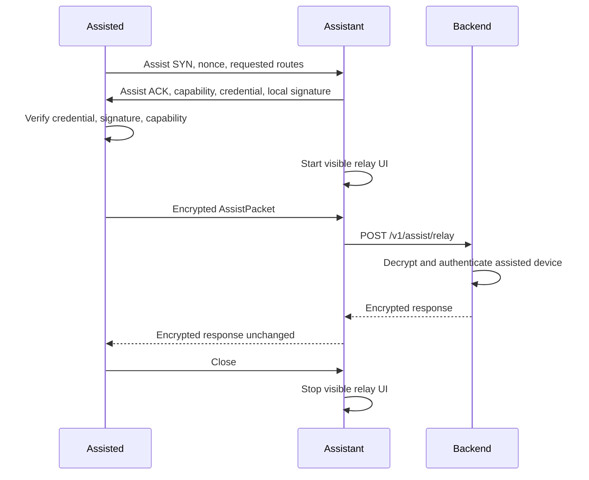

# 007 - Nearby Assist

## Goal

Define Nearby Assist: a local relay protocol that lets one device route another nearby device's encrypted backend-bound packets through its internet connection.

Nearby Assist is separate from Radar, but it reuses Radar's underlying platform transport adapters.

```text
Radar:
  nearby discovery and payment identity verification

Nearby Assist:
  blind encrypted packet relay through a willing nearby device
```

## Core Principle

The assisting device is transport only.

```text
Assisted device:
  creates encrypted backend-bound packets

Assisting device:
  forwards packets and returns encrypted responses

Backend:
  decrypts and authenticates the assisted device
```

The assisting device must not:

- read payload contents
- modify payload contents
- spoof the assisted sender
- authorize payments
- learn payer, recipient, amount, or transaction contents

The assisting device must still authenticate locally. A device should not be used as a relay unless it proves it is a genuine Nearby-capable app instance using the same local device credential model defined for Radar.

## Grounding

The design is based on current platform constraints:

- iOS Live Activities can show ongoing app state on the Lock Screen and Dynamic Island, but they are presentation surfaces, not unlimited background execution entitlements. See [Apple Live Activities](https://developer.apple.com/documentation/ActivityKit/displaying-live-data-with-live-activities).
- iOS Core Bluetooth background work is constrained and background scanning/advertising behaves differently from foreground behavior. See [Apple Core Bluetooth Background Processing](https://developer.apple.com/library/archive/documentation/NetworkingInternetWeb/Conceptual/CoreBluetooth_concepts/CoreBluetoothBackgroundProcessingForIOSApps/PerformingTasksWhileYourAppIsInTheBackground.html).
- Android foreground services are the platform mechanism for visible ongoing work, but they require a notification and have background-start restrictions. See [Android Foreground Services](https://developer.android.com/develop/background-work/services/foreground-services).
- Nearby Assist active-session keep-alives are protocol liveness pings between connected peers. They are not an attempt to bypass OS background execution rules.

## Non-Goals

Nearby Assist does not define:

- Radar peer identity verification
- SuiNS profile resolution
- payment authorization
- Sui transaction signing
- Bridge deposits
- AVS authorization
- arbitrary proxying or internet tunneling

Nearby Assist only relays allowlisted encrypted backend-bound packets.

## Roles

```text
assisted:
  device that needs connectivity

assistant:
  nearby device with assist enabled

backend:
  receives blind relay packets and authenticates the assisted device
```

The assistant must explicitly enable Nearby Assist.

There is no silent relay mode.

The assistant must authenticate to the assisted device before relaying begins.

Assistant authentication uses the same local trust mechanism as Radar:

```text
server-signed device credential
local transcript signature
fresh nonce
credential expiry check
nearby assist capability check
```

This prevents routing through fake app instances or unauthenticated local peers.



## Capability Discovery

Nearby Assist uses the underlying Radar transport stack for local discovery.

The assisted device sends an assist-specific SYN:

```swift
public struct AssistSyn: Codable, Sendable {
    public let protocolVersion: UInt8
    public let sessionId: Data
    public let nonce: Data
    public let requestedRoutes: [AssistRoute]
    public let maxPacketBytes: UInt32
}
```

Nearby devices reply with an assist ACK:

```swift
public enum AssistAck: Codable, Sendable {
    case available(AssistAvailable)
    case unavailable(AssistUnavailable)
}

public struct AssistAvailable: Codable, Sendable {
    public let sessionId: Data
    public let nonce: Data
    public let hasInternet: Bool
    public let willingToRelay: Bool
    public let maxSessionSeconds: UInt32
    public let maxPacketBytes: UInt32
    public let relayPublicKey: Data
    public let deviceCredential: DeviceIdentityCredential
    public let localTranscriptSignature: Data
}

public struct AssistUnavailable: Codable, Sendable {
    public let sessionId: Data
    public let nonce: Data
    public let hasInternet: Bool
    public let willingToRelay: Bool
}
```

This supports the four expected states:

```text
hasInternet=true,  willingToRelay=true
hasInternet=false, willingToRelay=true
hasInternet=true,  willingToRelay=false
hasInternet=false, willingToRelay=false
```

The assisted device should choose only:

```text
hasInternet=true
willingToRelay=true
```

Other states may be used for diagnostics or UX hints.

Before choosing an assistant, the assisted device verifies:

```text
1. assistant device credential signature
2. assistant credential expiry
3. assistant credential allows Nearby Assist
4. assistant local transcript signature over AssistSyn/AssistAck transcript
5. assistant nonce freshness
```

If verification fails, the assisted device must not open an assist session with that peer.

## Session Open

After choosing an assistant, the assisted device opens a relay session.

```swift
public struct AssistOpen: Codable, Sendable {
    public let protocolVersion: UInt8
    public let sessionId: Data
    public let assistedEphemeralPublicKey: Data
    public let serverKeyId: String
    public let requestedRoutes: [AssistRoute]
    public let maxDurationMs: UInt64
    public let maxPacketBytes: UInt32
}

public struct AssistOpenAck: Codable, Sendable {
    public let sessionId: Data
    public let assistantEphemeralPublicKey: Data
    public let acceptedRoutes: [AssistRoute]
    public let maxPacketBytes: UInt32
    public let expiresAtMs: UInt64
    public let localTranscriptSignature: Data
}
```

The assistant starts visible relay UI only after accepting an assist session.

## Packet Stream

Packets are sequenced and relayed over the open local connection.

```swift
public struct AssistPacket: Codable, Sendable {
    public let sessionId: Data
    public let sequence: UInt64
    public let route: AssistRoute
    public let envelope: AssistEnvelope
}

public struct AssistPacketResult: Codable, Sendable {
    public let sessionId: Data
    public let sequence: UInt64
    public let status: AssistPacketStatus
    public let responseCiphertext: Data
}
```

The assistant forwards `AssistEnvelope` to:

```text
POST /v1/assist/relay
```

The assistant does not parse the envelope.

The assistant must return the encrypted backend response to the assisted device as `AssistPacketResult.responseCiphertext`.

The assistant must not decrypt, inspect, rewrite, or synthesize successful backend responses. If the backend request fails, the assistant returns a transport/backend status without inventing application-level results.

The assistant may observe:

- route enum
- packet size
- sequence number
- timing
- session id

The assistant must not observe:

- payer
- recipient
- amount
- transaction body
- backend session token
- payment result plaintext

## Assist Envelope

The assisted device encrypts to the backend server public key.

Use hybrid encryption.

```swift
public struct AssistEnvelope: Codable, Sendable {
    public let version: UInt8
    public let algorithm: AssistEnvelopeAlgorithm
    public let senderKeyId: String
    public let serverKeyId: String
    public let ephemeralPublicKey: Data
    public let ciphertext: Data
    public let aad: AssistEnvelopeAAD
    public let senderIntegrityProof: DeviceIntegrityProof
}

public struct AssistEnvelopeAAD: Codable, Sendable {
    public let route: AssistRoute
    public let sessionId: Data
    public let sequence: UInt64
    public let nonce: Data
    public let createdAtMs: UInt64
    public let expiresAtMs: UInt64
}
```

The platform device integrity proof binds the ciphertext hash and AAD.

Backend verification:

```text
1. strict parse relay request
2. reject expired envelope
3. decrypt envelope
4. verify inner assisted-device session
5. verify platform device integrity proof over ciphertext hash and AAD
6. verify route is allowed for Nearby Assist
7. process as assisted device
8. return encrypted response
```

The backend authenticates the assisted device, not the assistant.

The backend may rate-limit or abuse-score the assistant as transport metadata, but backend authorization for the relayed action must come from the assisted device's decrypted payload.

## Allowed Routes

Nearby Assist is not a general HTTP proxy.

Allowed routes should stay narrow:

```swift
public enum AssistRoute: String, Codable, Sendable {
    case paymentSubmit = "payment.submit"
    case sessionRefresh = "session.refresh"
    case depositOptions = "deposit.options"
    case nameRegister = "name.register"
}
```

Routes may be added only after security review.

## Liveness Keep-Alive

The active assist session uses short interval pings between the assisted and assisting devices.

Purpose:

- detect dead connection
- keep local transport state fresh
- keep relay UI accurate
- close promptly when the assistant stops responding

```swift
public struct AssistKeepAlive: Codable, Sendable {
    public let sessionId: Data
    public let sequence: UInt64
    public let timestampMs: UInt64
}

public struct AssistKeepAliveAck: Codable, Sendable {
    public let sessionId: Data
    public let sequence: UInt64
    public let timestampMs: UInt64
}
```

Suggested interval:

```text
active session:
  5 seconds

missed acknowledgements:
  close after 2-3 missed pings
```

Keep-alives are application-level liveness pings. They are not a guarantee against OS suspension or background execution limits.

## Close

The assisted device owns normal close.

```swift
public struct AssistClose: Codable, Sendable {
    public let sessionId: Data
    public let finalSequence: UInt64
    public let reason: AssistCloseReason
}
```

Close reasons:

```swift
public enum AssistCloseReason: String, Codable, Sendable {
    case completed
    case cancelledByAssisted
    case cancelledByAssistant
    case expired
    case transportLost
    case backendRejected
    case packetLimitExceeded
}
```

The assistant may also close if:

- user disables assist
- session expires
- transport disconnects
- packet limit is exceeded
- backend repeatedly rejects packets
- battery or OS policy requires termination

## State Machines

Assisted:

```text
idle
-> searching
-> opening
-> open
-> sending
-> closing
-> closed
```

Assistant:

```text
idle
-> advertisingCapability
-> accepting
-> relaying
-> closing
-> closed
```

## Visible Relay UX

The assistant must show visible relay state while actively relaying.

iOS:

```text
Live Activity / Dynamic Island when available
```

Android:

```text
foreground service notification
```

User-facing copy should make the blind relay property clear:

```text
Relaying a nearby payment
The contents are encrypted.
You cannot see who or how much.
```

Required control:

```text
Stop Relaying
```

Stopping relay sends or triggers `AssistClose(reason: cancelledByAssistant)`.

## Backend Relay Contract

The backend exposes one route:

```text
POST /v1/assist/relay
```

Request:

```ts
export const assistRelayRequestSchema = z
    .object({
        envelope: assistEnvelopeSchema,
    })
    .strict();
```

No nullable fields.
No unknown keys.
No arbitrary route strings outside `AssistRoute`.

Response:

```ts
export type AssistRelayResponse = {
    responseCiphertext: string;
};
```

The backend must not trust assistant-supplied identity for authorization.

## Failure And Idempotency

The assisted device must use idempotency keys inside encrypted payloads for backend actions that can be retried.

Retry rules:

- retry only when packet result is transport failure or retryable backend status
- never blindly replay a payment submission without idempotency
- close session after retry budget is exhausted

The assistant should not implement semantic retry logic. It forwards packets and reports transport/backend result.

## Security Rules

- Assistant must opt in.
- Assistant must show active relay UI while relaying.
- Assistant cannot decrypt payloads.
- Assistant cannot modify payloads without backend rejection.
- Backend authenticates assisted device after decrypting.
- Routes are allowlisted.
- Packets are sequenced.
- Envelopes expire.
- Keep-alives detect dead local connections.
- Relay session closes explicitly or by policy.

## Testing Rules

Tests must cover:

- capability ACK exposes all four availability states
- assisted selects only internet + willing relay
- assisted rejects unauthenticated assistant
- assisted rejects assistant with invalid device credential
- assisted rejects assistant with invalid local transcript proof
- assistant cannot decrypt envelope
- tampered ciphertext is rejected by backend
- tampered AAD is rejected by backend
- backend authenticates assisted device, not assistant
- assistant returns encrypted backend response to assisted device
- assistant cannot synthesize successful application response
- route outside allowlist is rejected
- packet sequence replay is rejected
- keep-alive timeout closes session
- assisted close terminates relay session
- assistant cancel terminates relay session
- relay UI state starts on accepted session and ends on close

## Open Questions

- Whether assist capability should require full Radar peer verification before opening.
- Whether the assistant should receive reputation/credit for relaying.
- Exact max session duration for payment relay.
- Exact packet size limit per transport.
- Whether `deposit.options` should be allowed over Nearby Assist in V1.
- Whether `session.refresh` should be allowed over Nearby Assist or require direct internet.

## Review Checklist

Before implementing Nearby Assist, verify:

- Is the assistant explicitly opted in?
- Is the assistant authenticated with Radar-style local device trust?
- Is the assistant transport-only?
- Is the assisted payload encrypted to the backend?
- Does the assistant return the backend encrypted response unchanged?
- Does the backend authenticate the assisted device only?
- Are routes allowlisted?
- Are keep-alives application-level liveness pings?
- Does the assistant show visible relay state?
- Can either side close safely?
- Is payment retry idempotent?
