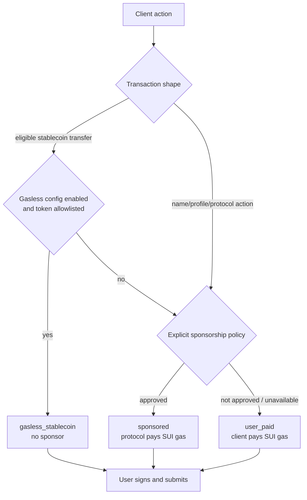
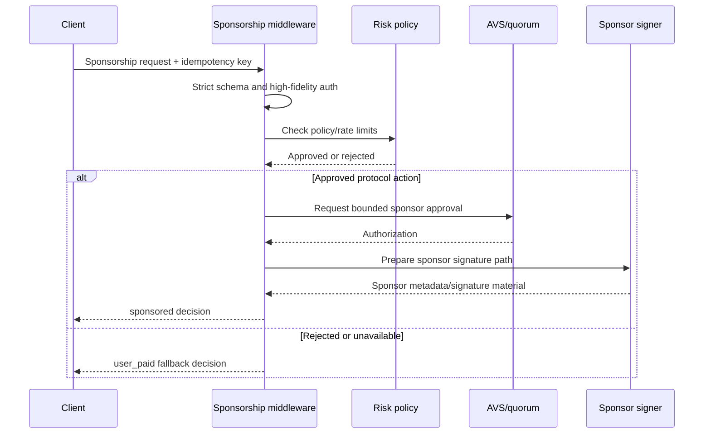

# 009 - Transaction Funding

## Goal

Define how nearby payments chooses the transaction funding path for Sui actions.

This document exists so funding policy does not bloat AVS, SuiNS, or payment protocol docs.

It covers:

- gasless USDsui readiness
- explicit sponsorship middleware
- client-side funding mode selection
- user-paid fallback
- strict schemas for funding decisions
- where backend involvement is allowed

## Grounding

The design is based on the following current platform facts:

- Sui supports sponsored transactions, where a sponsor pays gas while the user remains the transaction sender and signs the user-owned action. See [Sui Sponsored Transactions](https://docs.sui.io/guides/developer/transactions/sponsor-txn).
- The Sui TypeScript SDK supports sponsored transactions by building transaction kind bytes, reconstructing the transaction, setting sender, gas owner, and gas payment, then collecting both user and sponsor signatures. See [Mysten TypeScript SDK Sponsored Transactions](https://sdk.mystenlabs.com/sui/transaction-building/sponsored-transactions).
- Sui documents gasless stablecoin transfers as a separate payment path for allowlisted stablecoin transfers. As of this document, the feature is Testnet-only, with Mainnet availability planned later. Eligibility is constrained to allowlisted stablecoin types and narrow address-balance transfer PTBs such as `0x2::balance::send_funds<T>`, with `gasPayment` empty and `gasPrice = 0`. See [Gasless Stablecoin Transfers](https://docs.sui.io/develop/transaction-payment/gasless-stablecoin-transfers).

## Core Principle

Funding is not authority.

```text
authority:
  user signature, AVS authorization when required, and Sui contract rules

funding:
  gasless stablecoin path, protocol sponsor, or user-paid gas
```

The backend may decide whether the protocol pays gas. It must not use funding to become transaction authority.

## Funding Modes

```ts
export type TransactionFundingMode =
    | {
          kind: 'gasless_stablecoin';
          transport: 'grpc' | 'graphql';
      }
    | {
          kind: 'sponsored';
          sponsorAddress: string;
          sponsorshipExpiresAtMs: number;
      }
    | {
          kind: 'user_paid';
          reason: 'gasless_unavailable' | 'sponsor_unavailable' | 'risk_policy' | 'user_choice';
      };
```

Mode meanings:

- `gasless_stablecoin`
  - preferred future path for eligible USDsui peer payments
  - no sponsor signature
  - no sponsor gas object
  - backend not required for normal local peer payment
- `sponsored`
  - protocol pays gas with SUI
  - user still signs user-owned action
  - used for SuiNS actions and other approved protocol flows
- `user_paid`
  - user pays SUI gas directly
  - required fallback when sponsorship or gasless transfer is unavailable

## Policy

Default funding policy:

```text
Bridge crypto deposits:
  handled by Bridge deposit route lifecycle

SuiNS name registration:
  protocol sponsored when available

User-owned SuiNS leaf actions from the app:
  protocol sponsored when available

USDsui peer payments:
  use Sui gasless stablecoin transfer path when eligible and available
  otherwise fall back to user-paid gas or explicit sponsorship policy
```

Peer payment sponsorship is transitional. It is allowed only behind explicit policy because sponsoring peer payments makes the backend part of the transaction payment path.

When gasless USDsui becomes available on Mainnet and USDsui is in the protocol allowlist, `payment.usdsui_transfer` should resolve to `gasless_stablecoin` and bypass sponsor gas.



## Sponsorship Middleware

Sponsorship must be a single backend middleware/service boundary, not route-specific ad hoc code.

The middleware decides only whether the protocol may pay gas. It must not decide whether the user action is valid. User action validity belongs to client signing, strict route schemas, AVS authorization when required, and Sui contract rules.

Middleware responsibilities:

- enforce sponsorable action allowlist
- require high-fidelity auth for sponsored requests
- require strict Zod request shape
- require idempotency key for external-effect sponsorship
- enforce risk and rate-limit policy
- attach a sponsorship decision to route context
- never mutate user payloads
- never sponsor forbidden AVS actions

## Strict Schemas

```ts
import { z } from 'zod';

export const sponsorshipRequestSchema = z
    .object({
        action: z.enum([
            'leaf_name.register_initial',
            'leaf_name.update_target',
            'leaf_name.revoke',
            'profile_metadata.update',
            'payment.usdsui_transfer',
        ]),
        chain: z.enum(['sui:mainnet', 'sui:testnet']),
        sender: z.string().regex(/^0x[a-fA-F0-9]{64}$/),
        transactionKindHash: z.string().regex(/^0x[a-fA-F0-9]{64}$/),
        idempotencyKey: z.string().min(16),
    })
    .strict();

export const sponsorshipDecisionSchema = z.discriminatedUnion('status', [
    z
        .object({
            status: z.literal('approved'),
            mode: z.literal('sponsored'),
            sponsorAddress: z.string().regex(/^0x[a-fA-F0-9]{64}$/),
            expiresAtMs: z.number().int().positive(),
        })
        .strict(),
    z
        .object({
            status: z.literal('not_required'),
            mode: z.literal('gasless_stablecoin'),
            reason: z.literal('eligible_for_gasless_transfer'),
        })
        .strict(),
    z
        .object({
            status: z.literal('rejected'),
            mode: z.literal('user_paid'),
            reason: z.enum(['risk_policy', 'rate_limited', 'unsupported_action', 'sponsor_unavailable']),
        })
        .strict(),
]);
```

The request contains no optional or nullable action-critical fields. The caller must provide the exact structure.

## Hono Middleware Shape

```ts
import type { MiddlewareHandler } from 'hono';

type SponsorshipVariables = {
    sponsorship: z.infer<typeof sponsorshipDecisionSchema>;
};

export function sponsorshipMiddleware(): MiddlewareHandler<{ Variables: SponsorshipVariables }> {
    return async (c, next) => {
        const body = sponsorshipRequestSchema.parse(await c.req.json());
        const decision = await c.var.services.sponsorship.decide({
            action: body.action,
            chain: body.chain,
            sender: body.sender,
            transactionKindHash: body.transactionKindHash,
            idempotencyKey: body.idempotencyKey,
            auth: c.var.auth,
        });

        c.set('sponsorship', sponsorshipDecisionSchema.parse(decision));
        await next();
    };
}
```

Routes that need their own product payload should not parse the same request body twice. In implementation, use the project's standard validated-body middleware to parse once, then pass the validated sponsorship portion into `services.sponsorship.decide`.



## Client Funding Selector

The client should use one funding selector for USDsui sends.

```ts
export type PaymentFundingInput = {
    chain: 'sui:mainnet' | 'sui:testnet';
    stablecoinType: string;
    transactionShape: 'balance_send_funds' | 'other';
    gaslessAllowedTokenTypes: readonly string[];
    gaslessStablecoinsEnabled: boolean;
    sponsorship: TransactionFundingMode;
};

export function selectPaymentFundingMode(input: PaymentFundingInput): TransactionFundingMode {
    const canUseGaslessStablecoin =
        input.gaslessStablecoinsEnabled &&
        input.transactionShape === 'balance_send_funds' &&
        input.gaslessAllowedTokenTypes.includes(input.stablecoinType);

    if (canUseGaslessStablecoin) {
        return {
            kind: 'gasless_stablecoin',
            transport: 'grpc',
        };
    }

    if (input.sponsorship.kind === 'sponsored') {
        return input.sponsorship;
    }

    return {
        kind: 'user_paid',
        reason: 'gasless_unavailable',
    };
}
```

The production switch must be data/config driven:

```ts
export type GaslessStablecoinConfig = {
    enabled: boolean;
    chain: 'sui:mainnet' | 'sui:testnet';
    allowedTokenTypes: readonly string[];
};
```

Current Mainnet config must set `enabled: false` until Sui Mainnet supports the feature and USDsui is present in the protocol allowlist. The client should already carry the `gasless_stablecoin` branch so enabling Mainnet support is a config and eligibility change, not a payment flow rewrite.

## Gasless Stablecoin Transfer Snippet

USDsui peer payments should use Sui's gasless stablecoin transfer path only when the current network, protocol config, token type, and transaction shape are eligible.

This is not an AVS sponsorship flow. The backend should not be involved in normal local peer payments.

```ts
import { SuiGrpcClient } from '@mysten/sui/grpc';
import { Transaction } from '@mysten/sui/transactions';

export async function buildGaslessStablecoinTransfer(input: {
    grpcClient: SuiGrpcClient;
    sender: string;
    recipient: string;
    stablecoinType: string;
    amount: bigint;
}) {
    const tx = new Transaction();

    tx.setSender(input.sender);
    tx.moveCall({
        target: '0x2::balance::send_funds',
        typeArguments: [input.stablecoinType],
        arguments: [
            tx.balance({
                type: input.stablecoinType,
                balance: input.amount,
            }),
            tx.pure.address(input.recipient),
        ],
    });

    return tx.build({
        client: input.grpcClient,
    });
}
```

The SDK path above relies on gRPC or GraphQL simulation to detect eligibility and set the gas price and gas budget correctly. If using JSON-RPC, the implementation must first confirm that the stablecoin type is in Sui's gasless allowlist before setting gas price to `0`.

If the transaction includes app Move calls, object writes, non-allowlisted token types, swaps, name mutations, or any action outside Sui's gasless transfer constraints, it must not use this path.

## Sponsored Transaction Snippet

The implementation should follow Sui's dual-authority model:

```text
sender:
  user address

gas owner:
  sponsor address

signatures:
  user signature + sponsor signature
```

Client builds the transaction kind without gas data:

```ts
import { Transaction } from '@mysten/sui/transactions';

export async function buildRegisterLeafKind(input: {
    packageId: string;
    custodyObjectId: string;
    label: string;
    userAddress: string;
    avsAuthorization: Uint8Array;
    client: SuiClient;
}) {
    const tx = new Transaction();

    tx.moveCall({
        target: `${input.packageId}::names::register_leaf`,
        arguments: [
            tx.object(input.custodyObjectId),
            tx.pure.string(input.label),
            tx.pure.address(input.userAddress),
            tx.pure.vector('u8', Array.from(input.avsAuthorization)),
        ],
    });

    return tx.build({
        client: input.client,
        onlyTransactionKind: true,
    });
}
```

Sponsor reconstructs the transaction from kind bytes and sets sender, gas owner, and sponsor gas payment:

```ts
import { Transaction } from '@mysten/sui/transactions';

export async function sponsorTransaction(input: {
    kindBytes: Uint8Array;
    sender: string;
    sponsor: string;
    sponsorCoins: Array<{
        objectId: string;
        version: string;
        digest: string;
    }>;
}) {
    const tx = Transaction.fromKind(input.kindBytes);

    tx.setSender(input.sender);
    tx.setGasOwner(input.sponsor);
    tx.setGasPayment(input.sponsorCoins);

    return tx;
}
```

The final transaction must be signed by both the user and sponsor:

```ts
export async function signSponsoredTransaction(input: {
    transaction: Transaction;
    userSigner: Signer;
    sponsorSigner: Signer;
}) {
    const userSignature = await input.userSigner.signTransaction(input.transaction);
    const sponsorSignature = await input.sponsorSigner.signTransaction(input.transaction);

    return {
        transaction: input.transaction,
        signatures: [userSignature.signature, sponsorSignature.signature],
    };
}
```

Either the client or backend may submit the dual-signed transaction:

```ts
export async function submitSponsoredTransaction(input: {
    client: SuiClient;
    transactionBytes: Uint8Array;
    signatures: string[];
}) {
    return input.client.executeTransactionBlock({
        transactionBlock: input.transactionBytes,
        signature: input.signatures,
        options: {
            showEffects: true,
            showObjectChanges: true,
        },
    });
}
```

Backend submission is transport only. It must not replace the user's signature or prevent direct client submission when the user has a valid dual-signed transaction.

## Atomicity And Queues

Internal transaction paths that require atomic admission must pass through the existing Durable Object or equivalent atomic primitive for the deployment target. Do not create duplicate Durable Objects for the same transaction path.

Use idempotency keys for all important sponsorable actions.

Queue policy is global and belongs in `001-arch-organization`: any high-traffic or slow operation should be queued when it does not need to complete synchronously. Transaction funding follows that same rule; it does not define a sponsorship-only queue policy.

## Testing Rules

Tests must cover:

- strict schema rejects unknown keys
- strict schema rejects missing action-critical values
- strict schema rejects `null` and `undefined`
- gasless branch is disabled on Mainnet until config enables it
- gasless branch requires allowlisted token type
- gasless branch requires `balance_send_funds` transaction shape
- sponsorship middleware rejects unsupported actions
- sponsorship middleware requires high-fidelity auth
- sponsorship rejection allows user-paid fallback when the contract permits it
- backend submission never replaces user signature
