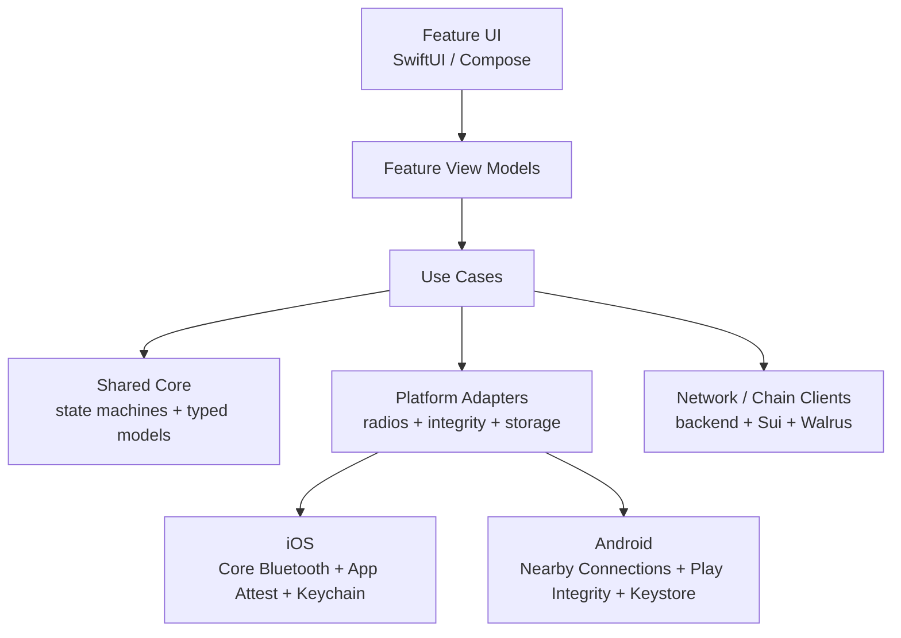
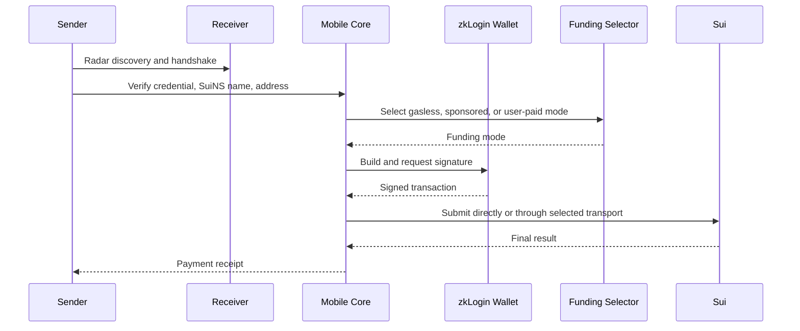

# 010 - Mobile App Architecture

## Goal

Define the mobile app architecture for nearby payments.

The mobile app is the primary product surface. It owns:

- local nearby discovery UX
- Radar sessions
- Nearby Assist sessions
- self-custody wallet authority
- zkLogin signing
- Sui transaction construction and submission
- deposit route UX
- SuiNS and Walrus profile display
- resilient offline/local-first payment handoff

The backend is a control plane. The mobile app is where nearby payments actually happens.

## Related Docs

- `002-arch-auth`
  - OAuth, platform device integrity, backend session, blind auth, and local peer auth
- `004-arch-custodial-profiles`
  - SuiNS leaf names and Walrus profile source of truth
- `005-arch-deposit-routes`
  - Bridge KYC/account/deposit route state machine
- `006-arch-radar-protocol`
  - local discovery and peer verification
- `007-arch-nearby-assist`
  - local blind relay protocol
- `009-arch-transaction-funding`
  - gasless/sponsored/user-paid funding selection

## Grounding

The design is based on platform facts already used by the protocol docs:

- iOS nearby discovery must use native platform capabilities such as Core Bluetooth and Network.framework, with background behavior constrained by iOS execution rules.
- Android nearby discovery should start with Nearby Connections where available, with BLE and Wi-Fi Aware as platform-specific adapters.
- iOS App Attest is the required device integrity primitive for high-fidelity auth on supported iOS devices.
- Android does not provide App Attest. Android high-fidelity auth uses Google Play Integrity API as the platform device integrity adapter.
- Swift can be used for shared Android libraries through Swift Android tooling and Java/Kotlin interop, but radio integrations and UI remain platform-native.

## Core Principle

Keep domain protocol logic shared; keep platform capability code native.

```text
shared core:
  protocol messages, session state machines, cryptography envelopes,
  wallet transaction models, funding selection, typed API clients

iOS native:
  SwiftUI, Core Bluetooth, Network.framework, App Attest,
  ActivityKit, Keychain, background modes

Android native:
  Compose, Nearby Connections, BLE, Wi-Fi Aware,
  Play Integrity, Keystore, foreground services
```

Do not hide platform radio differences behind a fake universal abstraction. Use a shared protocol engine with platform-specific transport adapters.

## Monorepo Shape

```text
apps/
  ios/
  android/

packages/
  mobile-core/
    Sources/
      NearbyCore/
      NearbyAuth/
      NearbyWallet/
      NearbyRadar/
      NearbyAssist/
      NearbyFunding/
      NearbyDeposits/
      NearbyProfiles/
      NearbyAPI/
      NearbyObservability/

  mobile-ui-swift/
    Sources/
      NearbyDesignSystem/
      NearbySharedViews/

  android-bridge/
    kotlin/
    swift-java-bindings/
```

V1 should be Swift-first for shared core because the project is already leaning toward pure Swift packages and iOS quality. Android should call the shared core only where the interop is stable and worth the complexity.

If Swift-on-Android interop becomes a drag, keep protocol definitions duplicated through generated schemas and move only deterministic protocol logic into shared Swift later. Do not block Android platform work on perfect shared-core purity.

## App Layering

```text
Feature UI
  SwiftUI / Compose screens

Feature View Models
  presentation state, user intents, navigation

Use Cases
  app workflows, orchestration, permissions, retries

Shared Core
  protocol state machines, typed models, funding selection, validation

Platform Adapters
  radios, attestation, secure storage, OAuth browser, push, background work

Network / Chain Clients
  backend API, Sui RPC/gRPC/GraphQL, Walrus, Bridge-hosted surfaces
```

UI must not call radios, Sui clients, or backend clients directly. View models call use cases. Use cases compose shared core and platform adapters.



## Module Responsibilities

### NearbyCore

Owns primitives used everywhere:

- `HexString`
- `SuiAddress`
- `AtomicAmount`
- `IdempotencyKey`
- `Nonce`
- `UnixMillis`
- strict enum/domain types
- deterministic encoding helpers

No platform APIs.

### NearbyAuth

Owns app-side auth flows:

- OAuth/PKCE session bootstrap
- zkLogin nonce binding
- platform device integrity proof calls
- backend session refresh
- high-fidelity request signing
- local device credential storage

This module consumes `002-arch-auth`. It must distinguish:

```swift
public enum BackendAuthMode: Sendable {
    case low
    case high
    case blind
}

public enum LocalAuthMode: Sendable {
    case radarPeer
    case assistPeer
}
```

### NearbyWallet

Owns Sui wallet authority:

- zkLogin ephemeral key lifecycle
- proof material management
- transaction signing
- transaction simulation when needed
- transaction submission when client submits directly
- local signing UX state

The backend must never be treated as wallet authority.

### NearbyFunding

Owns client-side funding path selection from `009-arch-transaction-funding`.

```swift
public enum TransactionFundingMode: Equatable, Sendable {
    case gaslessStablecoin(transport: StablecoinGaslessTransport)
    case sponsored(sponsorAddress: SuiAddress, expiresAt: UnixMillis)
    case userPaid(reason: UserPaidReason)
}

public enum StablecoinGaslessTransport: Sendable {
    case grpc
    case graphql
}

public enum UserPaidReason: Sendable {
    case gaslessUnavailable
    case sponsorUnavailable
    case riskPolicy
    case userChoice
}
```

Current Mainnet config keeps gasless USDsui disabled. The branch still exists so Mainnet enablement becomes config and eligibility, not a payment rewrite.

### NearbyRadar

Owns the shared Radar state machine from `006-arch-radar-protocol`:

- peer discovery model
- SYN/ACK messages
- session key derivation
- transcript hashing
- local peer verification
- payment request messages
- QR fallback payload parsing

It does not own Core Bluetooth, Nearby Connections, or Wi-Fi Aware directly. Those are adapters.

### NearbyAssist

Owns the shared Nearby Assist protocol from `007-arch-nearby-assist`:

- assist capability messages
- local assistant authentication
- encrypted packet envelopes
- packet sequence state
- keep-alive state
- close handshake

It does not expose arbitrary proxying.

### NearbyDeposits

Owns mobile presentation of Bridge route state from `005-arch-deposit-routes`:

- KYC required
- KYC pending
- virtual account details
- crypto deposit addresses
- deposit status display

It must not store KYC PII locally beyond what the OS/app naturally caches for display. Avoid durable local KYC payload storage.

### NearbyProfiles

Owns SuiNS and Walrus profile reads:

- resolve name to address
- fetch Walrus metadata
- cache non-sensitive display data
- invalidate by onchain metadata pointer/version

The backend is not a profile source of truth.

## Platform Adapters

Define narrow protocols in shared core, implement them per platform.

```swift
public protocol RadarTransport: Sendable {
    func startAdvertising(_ payload: RadarAdvertisement) async throws
    func startScanning() async throws -> AsyncStream<RadarDiscovery>
    func connect(to peer: RadarPeerHandle) async throws -> RadarConnection
    func stop() async
}

public enum DeviceIntegrityProof: Sendable {
    case iosAppAttest(IOSAppAttestProof)
    case androidPlayIntegrity(AndroidPlayIntegrityProof)
}

public protocol DeviceIntegrityProvider: Sendable {
    func prove(requestHash: Data) async throws -> DeviceIntegrityProof
}

public protocol SecureStorage: Sendable {
    func write(_ value: Data, for key: SecureStorageKey) async throws
    func read(_ key: SecureStorageKey) async throws -> Data
    func delete(_ key: SecureStorageKey) async throws
}
```

iOS implementations:

- `CoreBluetoothRadarTransport`
- `NetworkFrameworkLocalTransport`
- `AppAttestProvider`
- `KeychainSecureStorage`
- `ActivityKitAssistVisibility`

Android implementations:

- `NearbyConnectionsRadarTransport`
- `BleRadarTransport`
- `WifiAwareRadarTransport`
- `PlayIntegrityProvider`
- `AndroidKeystoreSecureStorage`
- `ForegroundServiceAssistVisibility`

## State Ownership

Use explicit state machines for workflows that can cross foreground/background/network boundaries.

```swift
public enum RadarSessionState: Equatable, Sendable {
    case idle
    case discovering
    case connecting(peer: RadarPeerSummary)
    case handshaking(peer: RadarPeerSummary)
    case verified(VerifiedRadarPeer)
    case paymentComposing(VerifiedRadarPeer)
    case signing(PaymentDraft)
    case submitting(SignedPayment)
    case completed(PaymentReceipt)
    case failed(RadarFailure)
}
```

Do not represent workflow state with multiple optional fields. The app should prefer enums with associated values so impossible states are unrepresentable.

## API Client

The mobile API client should be generated or typed from the OpenAPI/Zod contract.

Rules:

- no loosely typed JSON dictionaries for product routes
- no client-side normalization of malformed backend payloads
- no `null` placeholders
- every response handled as a discriminated union when the backend returns one
- high-fidelity routes attach a platform `DeviceIntegrityProof`
- idempotency keys are generated by the app for important external-effect requests

Example:

```swift
public enum DepositOptionsResponse: Equatable, Sendable {
    case kycRequired(KycRoute)
    case kycPending(KycPending)
    case accountDetails(VirtualAccountDetails)
    case depositAddresses(CryptoDepositAddresses)
}
```

## Payment Flow

Sender flow:

```text
1. discover peer through Radar
2. verify local peer credential and SuiNS name/address
3. compose USDsui amount
4. select funding mode
5. build Sui transaction
6. sign with zkLogin wallet
7. submit directly, through sponsor flow, or through Nearby Assist if offline
8. show final Sui result
```

Receiver flow:

```text
1. advertise local discoverability when allowed
2. authenticate to sender during Radar handshake
3. provide verified name/address/profile pointer
4. optionally display incoming payment status
5. refresh balance/profile state from Sui
```

Receiver approval is not required for settlement after sender has verified the recipient address.



## Offline And Assist

The app must separate:

- local peer discovery
- payment signing
- internet submission

If sender has no internet:

```text
sender signs payment
sender discovers assistant
sender encrypts backend-bound packet
assistant authenticates locally
assistant relays encrypted packet
backend returns encrypted response
assistant forwards response unchanged
sender decrypts and completes flow
```

Nearby Assist is never a general network tunnel.

## Background Behavior

The app must not promise always-on discovery.

Supported app behavior:

- foreground Radar is the primary flow
- recently backgrounded discovery is best-effort
- hibernated/force-quit/permission-denied discovery is not guaranteed
- QR fallback is always available
- visible relay UI is required for active assist sessions

Background platform limits are product constraints, not bugs to paper over.

## Local Persistence

Persist only what the app needs:

- backend session tokens
- zkLogin ephemeral material within its validity window
- device credentials
- Sui account address
- cached profile display metadata
- recent payment receipts
- pending idempotency records
- user preferences

Do not persist:

- KYC PII
- raw OAuth tokens beyond what auth requires
- unencrypted wallet authority material
- raw Nearby Assist payload plaintext
- profile source-of-truth copies

## Observability

Mobile telemetry should use structured, low-cardinality events.

Allowed:

- protocol stage
- transport type
- error code
- latency bucket
- permission state category
- funding mode
- final transaction status

Do not log:

- names
- addresses
- amounts
- KYC data
- OAuth tokens
- raw transaction bytes
- local discovery payloads
- Nearby Assist plaintext or ciphertext

## Testing Rules

Tests must cover:

- Radar state machine transitions
- local peer verification failure cases
- QR fallback parsing
- Nearby Assist relay cannot decrypt payloads
- funding selector chooses gasless only when enabled and eligible
- funding selector falls back to user-paid
- auth mode separation
- strict API response union handling
- no optional-field workflow state drift
- secure storage failures
- background permission denial paths

Platform integration tests should cover:

- iOS BLE foreground discovery
- iOS App Attest challenge/assertion flow
- Android Play Integrity requestHash flow
- Android Nearby Connections discovery
- Android BLE fallback
- assist visible-session lifecycle
- transaction signing and submission against Sui testnet/devnet

## Open Questions

- Which shared-core modules must be Swift-first in V1, and which can be duplicated on Android until interop is stable?
- Should Android launch with Nearby Connections first and add BLE parity later?
- What is the minimum supported iOS version for App Attest and nearby background behavior?
- What is the exact local profile cache retention policy?
- Which Sui client transport is used first for mobile: JSON-RPC, gRPC, or GraphQL?
- How should pending payment receipts be recovered after app reinstall?
